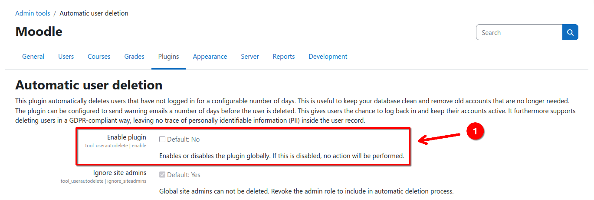

# Automatic User Deletion

[](https://github.com/ngandrass/moodle-tool_userautodelete/releases)
[%7D&replace=%24%3Cdata%3E&label=PHP&color=blue)](https://github.com/ngandrass/moodle-tool_userautodelete/blob/master/version.php)
[%7D&replace=%24%3Cdata%3E&label=Moodle&color=orange)](https://github.com/ngandrass/moodle-tool_userautodelete/blob/master/version.php)
[](https://github.com/ngandrass/moodle-tool_userautodelete/actions/workflows/moodle-plugin-ci.yml)
[](https://coveralls.io/github/ngandrass/moodle-tool_userautodelete)
[](https://github.com/ngandrass/moodle-tool_userautodelete/issues)
[](https://github.com/ngandrass/moodle-tool_userautodelete/pulls)
[](https://github.com/ngandrass/moodle-tool_userautodelete/)
[](https://github.com/ngandrass/moodle-tool_userautodelete/blob/master/LICENSE)
[](https://www.paypal.me/ngandrass)
[](https://github.com/sponsors/ngandrass)
[](https://github.com/ngandrass/moodle-tool_userautodelete/stargazers)
[](https://github.com/ngandrass/moodle-tool_userautodelete/network/members)
[](https://github.com/ngandrass/moodle-tool_userautodelete/graphs/contributors)

This plugin manages the full lifecycle of Moodle user accounts using freely configurable, multi-step workflows.

Each workflow can consist of multiple steps with one or more filters (e.g. last access, authentication method, role
assignment, ...) that determine which users are selected, and actions (e.g. send email, suspend, delete, ...) that are
executed when a user enters a step. This allows building simple as well as sophisticated user lifecycle workflows, i.e.,
warn inactive users, suspend them after a grace period, and finally delete their accounts in a GDPR-compliant way. A
built-in dry-run mode and action log let administrators safely preview and audit all automated activity. The default
filters and actions can easily be extended by further subplugins.

The automatic user deletion plugin plugin is available via the [Moodle plugin directory](https://moodle.org/plugins/tool_userautodelete):

[](https://moodle.org/plugins/tool_userautodelete)


## Features

- Workflow-based user lifecycle management with freely configurable, multi-step workflows
- User filter subplugins for effectively targeting users. Core filters available:
  - Authentication method
  - Last access to site
  - Role assignment
  - Suspension state
  - Time delay
- Action subplugins to perform various operations. Core actions available:
  - Anonymize user account (GDPR compliance)
  - Delete user
  - Send mail to user
  - Suspend user
  - Unsuspend user
- GDPR-compliant user account anonymization and deletion
- Dry-run mode to safely preview which users would be affected without taking any action
- Action log to audit all sent mails, issued suspensions, and performed deletions
- Highly configurable (time thresholds, email templates, ...)
- Automated testing and support for all active Moodle releases


## Configuration and Usage

The plugin can be configured via the Moodle site administration under _Site administration > Plugins > Admin tools >
Automatic user deletion_.

After installation, the plugin will be disabled by default until you configure and enable it by checking the _Enable
plugin_ checkbox (1) and saving the settings.



## Usage

TODO. This section must still be written.


## Installation

This plugin can be installed like any other Moodle plugin by placing its source code inside your Moodle installation and
executing the upgrade routine afterward.


### Installing via the site administration (uploaded ZIP file)

1. Download the latest release of this plugin from the [Moodle plugin directory](https://moodle.org/plugins/tool_userautodelete).

2. Log in to your Moodle site as an admin and go to _Site administration > Plugins > Install plugins_.
3. Upload the ZIP file with the plugin code.
4. Check the plugin validation report and finish the installation.


### Installing manually

The plugin can be also installed by putting the contents of this directory into

```
{your/moodle/dirroot}/admin/tool/userautodelete
```

Afterwards, log in to your Moodle site as an admin and go to _Site administration > Notifications_ to complete the
installation.

Alternatively, you can run `php admin/cli/upgrade.php` from the command line to complete the installation.


## Reporting a bug or requesting a feature

If you find a bug or have a feature request, please open an issue via the [GitHub issue tracker](https://github.com/ngandrass/moodle-tool_userautodelete/issues).

Please do not use the comments section within the Moodle plugin directory. Thanks :)


## Testing

You can find testing instructions for developers in the [TESTING.md](TESTING.md) file.


## License

2026 Niels Gandraß <niels@gandrass.de>

This program is free software: you can redistribute it and/or modify it under
the terms of the GNU General Public License as published by the Free Software
Foundation, either version 3 of the License, or (at your option) any later
version.

This program is distributed in the hope that it will be useful, but WITHOUT ANY
WARRANTY; without even the implied warranty of MERCHANTABILITY or FITNESS FOR A
PARTICULAR PURPOSE.  See the GNU General Public License for more details.

You should have received a copy of the GNU General Public License along with
this program.  If not, see <https://www.gnu.org/licenses/>.
