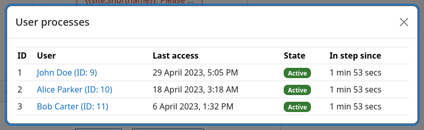

# Automatic User Lifecycle Management

[%7D&replace=%24%3Cdata%3E&label=PHP&color=blue)](https://github.com/ngandrass/moodle-tool_userautodelete/blob/master/version.php)
[%7D&replace=%24%3Cdata%3E&label=Moodle&color=orange)](https://github.com/ngandrass/moodle-tool_userautodelete/blob/master/version.php)

This plugin manages the full lifecycle of Moodle user accounts using freely configurable, multistep workflows.

Each workflow can consist of multiple steps with one or more filters (e.g. last access, authentication method, role
assignment, ...) that determine which users are selected, and actions (e.g. send email, suspend, delete, ...) that are
executed when a user enters a step. This allows building simple as well as sophisticated user lifecycle workflows, i.e.,
warn inactive users, suspend them after a grace period, and finally delete their accounts in a GDPR-compliant way. A
built-in dry-run mode and action log let administrators safely preview and audit all automated activity. The default
filters and actions can easily be extended by further subplugins.

The automatic user lifecycle management plugin is available via the [Moodle plugin directory](https://marketplace.moodle.com/plugins/tool_userautodelete):

More information about the plugin and a comprehensive
[quickstart guide](https://moodleuserlifecycle.gandrass.de/getstarted/) can be found in our
[online documentation](https://moodleuserlifecycle.gandrass.de/).

## Features

- Workflow-based user lifecycle management with freely configurable, multi-step workflows
- User filter subplugins for effectively targeting users. Core filters available:
  - Authentication method
  - Cohort membership
  - Course enrolment status
  - Current Date
  - Last access to site
  - Role assignment
  - Suspension state
  - Time delay
- Action subplugins to perform various operations. Core actions available:
  - Anonymize user account (GDPR compliance)
  - Delete user
  - Send mail to user
  - Suspend user
  - Unsuspend user
- GDPR-compliant user account anonymization and deletion
- Use of dynamic variables (e.g., user first and last names) in email templates
- Dry-run mode to safely preview which users would be affected without taking any action
- Action log to audit all sent mails, issued suspensions, and performed deletions
- Highly configurable (time thresholds, email templates, ...)
- Automated testing and support for all active Moodle releases

## Installation and configuration

You can find detailed installation, configuration, and usage instructions more in our comprehensive
[online documentation](https://moodleuserlifecycle.gandrass.de/). A
[quickstart guide](https://moodleuserlifecycle.gandrass.de/getstarted/) walks you through the installation and creation
of your first workflow in just a few minutes.

## Reporting a bug or requesting a feature

If you find a bug or have a feature request, please open an issue via the [GitHub issue tracker](https://github.com/ngandrass/moodle-tool_userautodelete/issues).

Please do not use the comments section within the Moodle plugin directory. Thanks :)

## Screenshots

This section contains some example screenshots of the plugin. You can find 
more screenshots in our [online documentation](https://moodleuserlifecycle.gandrass.de/screenshots/).

### Workflow overview

### Two-step workflow with filters and actions

### Configuration of an "Send Mail" action

### Listing users currently inside a workflow step

### Inspection of logged actions

## License

2026 Niels Gandraß <niels@gandrass.de>

This program is free software: you can redistribute it and/or modify it under
the terms of the GNU General Public License as published by the Free Software
Foundation, either version 3 of the License, or (at your option) any later
version.

This program is distributed in the hope that it will be useful, but WITHOUT ANY
WARRANTY; without even the implied warranty of MERCHANTABILITY or FITNESS FOR A
PARTICULAR PURPOSE.  See the GNU General Public License for more details.

You should have received a copy of the GNU General Public License along with
this program.  If not, see <https://www.gnu.org/licenses/>.
