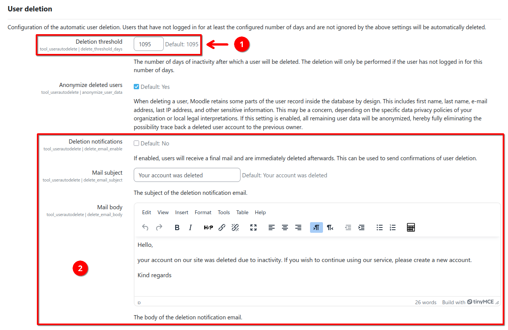
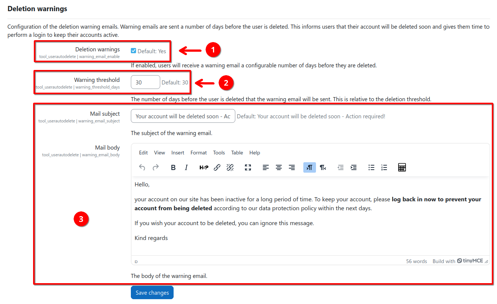

# Automatic User Deletion

[](https://github.com/ngandrass/moodle-tool_userautodelete/releases)
[](https://github.com/ngandrass/moodle-tool_userautodelete)
[](https://github.com/ngandrass/moodle-tool_userautodelete)
[](https://github.com/ngandrass/moodle-tool_userautodelete/actions/workflows/moodle-plugin-ci.yml)
[](https://coveralls.io/github/ngandrass/moodle-tool_userautodelete)
[](https://github.com/ngandrass/moodle-tool_userautodelete/issues)
[](https://github.com/ngandrass/moodle-tool_userautodelete/pulls)
[](https://github.com/ngandrass/moodle-tool_userautodelete/)
[](https://github.com/ngandrass/moodle-tool_userautodelete/blob/master/LICENSE)
[](https://www.paypal.me/ngandrass)
[](https://github.com/sponsors/ngandrass)
[](https://github.com/ngandrass/moodle-tool_userautodelete/stargazers)
[](https://github.com/ngandrass/moodle-tool_userautodelete/network/members)
[](https://github.com/ngandrass/moodle-tool_userautodelete/graphs/contributors)

This plugin automatically deletes users that have not logged in for a configurable number of days.

Automatically deleting users is useful to keep your database clean and remove old accounts that are no longer needed.
The plugin can be configured to send warning emails a number of days before the user is deleted. This gives users the
chance to log back in and keep their accounts active. It furthermore supports deleting users in a GDPR-compliant way,
leaving no trace of personally identifiable information (PII) inside the user record.

The automatic user deletion plugin plugin is available via the [Moodle plugin directory](https://moodle.org/plugins/tool_userautodelete):

[](https://moodle.org/plugins/tool_userautodelete)


## Features

- Automatically deleting inactive user accounts
- Sending warning emails to users before deletion
- GDPR-compliant deletion of user accounts
- Ignoring users with specific roles
- Dry-run mode for testing the configuration
- Highly configurable (deletion and warning thresholds, email templates, enabling/disabling of single features, etc.)
- Logging of deletion events
- Automated testing and support for all active Moodle releases


## Configuration and Usage

The plugin can be configured via the Moodle site administration under _Site administration > Plugins > Admin tools >
Automatic user deletion_.

After installation, the plugin will be disabled by default until you configure and enable it by checking the _Enable
plugin_ checkbox (1) and saving the settings.


### Automatic user deletion

If the plugin is enabled as described above, users that have not logged in for at least the configured number of days
will be deleted automatically. You can configure the number of days of inactivity via the _Deletion threshold_ setting (1).

The plugin also supports sending users an email right before their account is deleted. This is useful to give users a
final notice that their account is now deleted. You can enable sending such deletion notifications to users by checking
the _Deletion notifications_ checkbox and optionally adjust the email sent (2). If you wish to send users a warning
message a few days before their actual deletion to allow them to log back in and keep their account, please refer to
[account deletion warnings](#deletion--inactivity-warnings) below.




### Deletion / inactivity warnings

Warning emails can be sent a number of days before the user is deleted. This informs users that their account will be
deleted soon and gives them time to perform a login to keep their account active.

To enable this feature, check the _Deletion warnings_ checkbox (1) and set _Warning threshold_ (2) to the number of days
before the _Deletion threshold_ when the warning email should be sent. You can also customize the email sent to users
(3) if desired.

Note on the warning threshold: The warning threshold is the number of days before the deletion threshold that a warning
email is sent. So, for example, if you set your deletion threshold to 1095 days and your warning threshold to 30 days,
users will receive a warning email after 1065 days of inactivity. If they do not log in within the next 30 days, their
account will be deleted after the full 1095 days of inactivity. If, however, users log back in within the 30 days,
their account will be kept until it has been inactive for another 1095 days, receiving a warning email again after 1065
days of inactivity.




### GDPR-compliant user deletion

When deleting a user, Moodle retains some parts of the user record inside the database by design. This includes
first name, last name, e-mail address, last IP address, and other sensitive information. This may be a concern,
depending on the specific data privacy policies of your organization or local legal interpretations.

This plugin supports anonymizing the remaining user data when deleting a user. This means that all personally
identifiable information (PII) is removed from the database and replaced with generic data. For example, the firstname
and lastname are replaced with "DELETED" and their last IP address is replaced with "0.0.0.0".

To enable this feature, check the _Anonymize deleted users_ checkbox (1) inside the plugin settings within the
_User deletion_ section.


### Ignoring specific users

The plugin supports excluding users based on their role assignments. This means that a user that has a specific role
assigned to them will never be deleted nor receive any inactivity warning mails. Note that global site admins are always
excluded from deletion.

To exclude users with specific roles, mark the desired role in the _Ignored roles_ selector (1) and save your changes.


### Performing a dry-run

If you have configured the plugin to your liking, you can see which users would be affected by your current
configuration by using the dry-run feature. You can perform a dry-run by clicking the _Perform dry-run_ button on the
plugin settings page.


This will take you to a page that shows you all users that would be warned or deleted, based on your current
configuration.


### Changing the user check interval

By default, all users are checked for inactivity once per day. You can change the check frequency and time by using the
_Configure check interval_ button on the plugin settings page.


### Inspecting logs

The plugin logs all actions it performs. Every time a warning e-mail is sent, a user is finally deleted, or a user was
marked as recovered after a previously sent warning e-mail, an entry in this action log is created. User inactivity
checks that did not perform any actions are not logged.

You can inspect the action log by clicking the _View action log_ button on the plugin settings page.


This will take you to a page that shows you all performed actions in a sortable table. If no actions have been performed
yet, only an informational message will be displayed.


You can use the _View raw scheduled task logs_ button at the bottom of the page to quickly access the raw logs of the
scheduled task within the Moodle website administration for debugging purposes.


## Installation

This plugin can be installed like any other Moodle plugin by placing its source code inside your Moodle installation and
executing the upgrade routine afterward.


### Installing via the site administration (uploaded ZIP file)

1. Download the latest release of this plugin from the [Moodle plugin directory](https://moodle.org/plugins/tool_userautodelete).

2. Log in to your Moodle site as an admin and go to _Site administration > Plugins > Install plugins_.
3. Upload the ZIP file with the plugin code.
4. Check the plugin validation report and finish the installation.


### Installing manually

The plugin can be also installed by putting the contents of this directory into

```
{your/moodle/dirroot}/admin/tool/userautodelete
```

Afterwards, log in to your Moodle site as an admin and go to _Site administration > Notifications_ to complete the
installation.

Alternatively, you can run `php admin/cli/upgrade.php` from the command line to complete the installation.


## Reporting a bug or requesting a feature

If you find a bug or have a feature request, please open an issue via the [GitHub issue tracker](https://github.com/ngandrass/moodle-tool_userautodelete/issues).

Please do not use the comments section within the Moodle plugin directory. Thanks :)


## Testing

You can find testing instructions for developers in the [TESTING.md](TESTING.md) file.


## License

2025 Niels Gandraß <niels@gandrass.de>

This program is free software: you can redistribute it and/or modify it under
the terms of the GNU General Public License as published by the Free Software
Foundation, either version 3 of the License, or (at your option) any later
version.

This program is distributed in the hope that it will be useful, but WITHOUT ANY
WARRANTY; without even the implied warranty of MERCHANTABILITY or FITNESS FOR A
PARTICULAR PURPOSE.  See the GNU General Public License for more details.

You should have received a copy of the GNU General Public License along with
this program.  If not, see <https://www.gnu.org/licenses/>.
