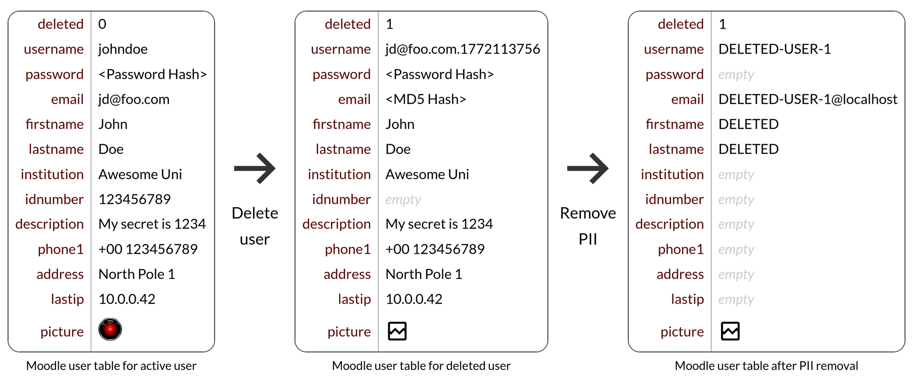

# Action: Anonymize User

When deleting a user account in Moodle, some personally identifiable information (PII) is retained in the database.
While this makes the data inaccessible via the UI, it still exists within the database and, depending on your local data
protection policies, should be removed.

The anonymize user action does exactly this. It irreversibly replaces any remaining personally identifiable information
within the Moodle users database table with placeholder values.

[:fontawesome-solid-user-secret: Anonymize User](#){.md-button .md-button-subplugin .md-button-subplugin-action .md-button-disabled}

!!! danger "Risk of data loss"
    The anonymization process is irreversible and will permanently remove personally identifiable information from user
    accounts.

## How it works

The anonymization process takes an existing user account and replaces any personally identifiable information (PII) with
placeholder values. This operation is done solely within the Moodle `users` database table. The diagram below shows
a user data record prior to and after deletion via Moodle's internal user deletion procedure as well as the result of
a subsequent anonymization by this action.

In detail, the following user data fields are anonymized:
`id`,
`username`,
`password`,
`idnumber`,
`firstname`,
`lastname`,
`email`,
`phone1`,
`phone2`,
`institution`,
`department`,
`address`,
`city`,
`country`,
`lastip`,
`secret`,
`picture`,
`description`,
`imagealt`,
`lastnamephonetic`,
`firstnamephonetic`,
`middlename`,
`alternatename`,
`moodlenetprofile`

You can audit the full source code of the anonymization process here: {{ source_file('action/anonymize/classes/userdeleteaction.php', 'userdeleteaction_anonymize\\userdeleteaction::execute()') }}

## Settings

This action has no configurable settings.

## Example

