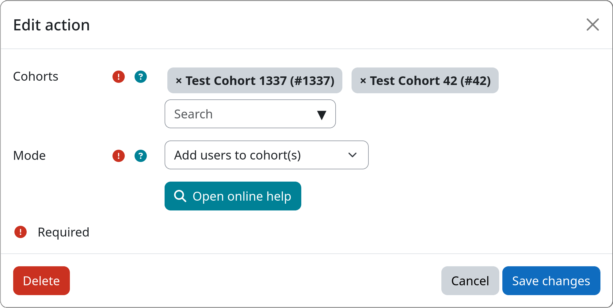

# Action: Cohort Membership

The **Cohort Membership** action adds users to or removes users from one or more [cohorts](https://docs.moodle.org/en/Cohorts).
This can be useful to automatically manage cohort membership for users or mark them during workflow execution.

[:fontawesome-solid-users: Cohort Membership](#){.md-button .md-button-subplugin .md-button-subplugin-action .md-button-disabled}

!!! info "Adding and removing from cohorts in a single step"
    A single instance of this action can only either add users to or remove users from cohorts. If you want to do both,
    you need to create two separate instances of this action within the same step, one for adding and one for removing
    users from cohorts.

## Settings

!!! setting "Cohorts"
    You can select one or more cohorts from the list of available cohorts on your Moodle site. Users are either added to
    or removed from the selected cohorts, depending on the chosen mode (see below).

    Be aware, that you need to create cohorts via {{ moodle_nav_path('Site administration', 'Users', 'Cohorts') }}
    first, before you can access them inside this action.

!!! setting "Mode"
    Allows to choose whether the action should add users to or remove users from the selected cohorts.

## Example

