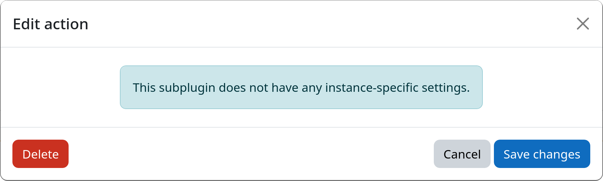

# Action: Delete User

The delete user action deletes a user account from Moodle.
Use this action in final workflow steps where accounts should be fully removed instead of being retained in an anonymized or suspended state.

[:fontawesome-solid-trash: Delete User](#){.md-button .md-button-subplugin .md-button-subplugin-action .md-button-disabled}

!!! danger "Risk of data loss"
    The deletion process is irreversible and will permanently remove user accounts from your Moodle site.

## How it works

This action simply executes Moodle's internal user deletion procedure (`delete_user()`).

!!! info "Deleting users leaves traces of personally identifiable information (PII)"
    Depending on your local data protection policies, you might want to consider anonymizing user accounts after
    deleting them. This way, personally identifiable information is reliably removed from your Moodle site while still
    retaining the actual user database record in an anonymized form for auditing or record-keeping purposes.

    See [anonymize user action](anonymize.md) for more details on the data that remains after deletion and how to deal
    with it.

## Settings

This action has no configurable settings.

## Example

