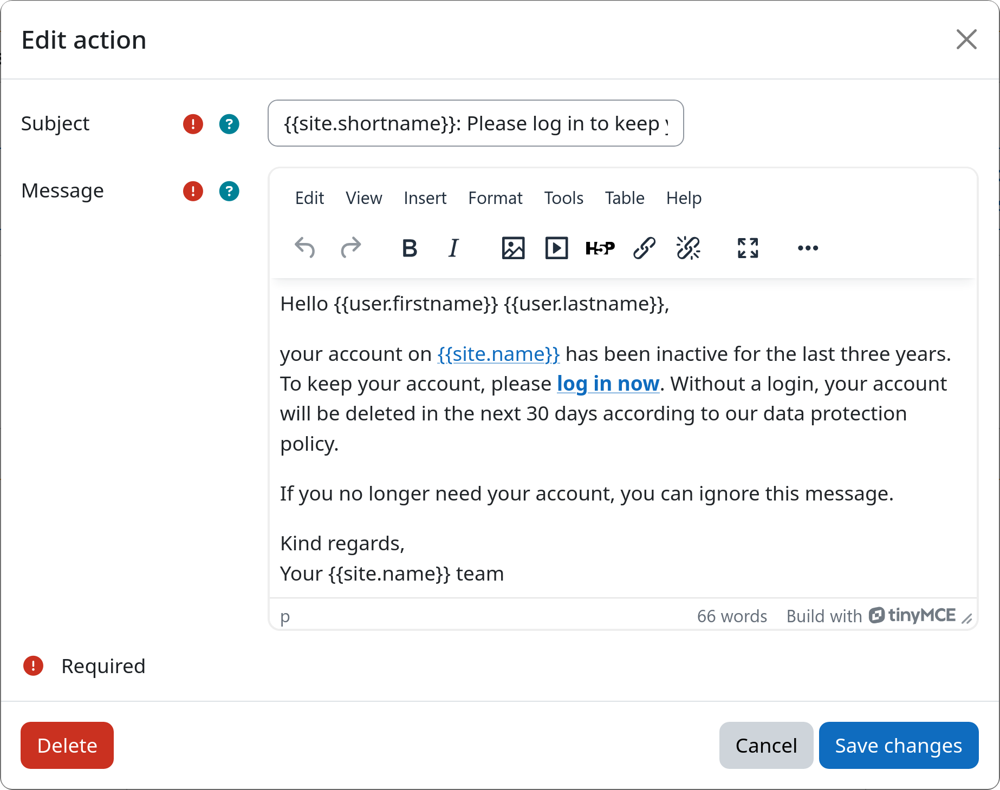

# Action: Send Mail

The send mail action emails users when they enter a workflow step. Mail subject and body can be fully customized and
allow the use of various dynamic variables. This action can be used for notifications, reminders, and warnings before
subsequent lifecycle actions are executed.

[:fontawesome-solid-envelope: Send Mail](#){.md-button .md-button-subplugin .md-button-subplugin-action .md-button-disabled}

## Dynamic variables

This action allows you to use various dynamic variables in both the subject and body of the email. These variables will
be automatically replaced with the corresponding information when the email is sent. All variables must always be
enclosed in double curly braces (`{{dcbl}}` and `{{dcbr}}`) to be recognized as placeholders.

The following variables are available:

**User information**

- `{{dcbl}}user.id{{dcbr}}` – User's numeric ID
- `{{dcbl}}user.username{{dcbr}}` – Username
- `{{dcbl}}user.firstname{{dcbr}}` – First name
- `{{dcbl}}user.lastname{{dcbr}}` – Last name
- `{{dcbl}}user.email{{dcbr}}` – Email address
- `{{dcbl}}user.idnumber{{dcbr}}` – User's ID number
- `{{dcbl}}user.institution{{dcbr}}` – Institution
- `{{dcbl}}user.timecreated{{dcbr}}` – Account creation date and time
- `{{dcbl}}user.lastaccess{{dcbr}}` – Last access date and time
- `{{dcbl}}user.lastaccessrelative{{dcbr}}` – Relative time since last access
- `{{dcbl}}user.lastip{{dcbr}}` – Last IP address
- `{{dcbl}}user.city{{dcbr}}` – City
- `{{dcbl}}user.country{{dcbr}}` – Country code

**Moodle site information**

- `{{dcbl}}site.name{{dcbr}}` – Site full name
- `{{dcbl}}site.shortname{{dcbr}}` – Site short name
- `{{dcbl}}site.supportemail{{dcbr}}` – Site support email address

**URLs to various relevant pages on the Moodle site**

- `{{dcbl}}urls.home{{dcbr}}` – Site base URL
- `{{dcbl}}urls.login{{dcbr}}` – Login page URL
- `{{dcbl}}urls.profile{{dcbr}}` – Target user profile URL
- `{{dcbl}}urls.support{{dcbr}}` – Contact site support URL

## Settings

!!! setting "Subject"
    Defines the email subject line. You can use plain text and placeholders for dynamic variables (see above).

!!! setting "Message"
    Defines the email body. You can use rich text (Moodle editor) and placeholders for dynamic variables (see above).

If invalid placeholders for dynamic variables are used, an error message will be displayed that lists all the unresolved
placeholders. You can then adjust your text accordingly before saving.

## Example

