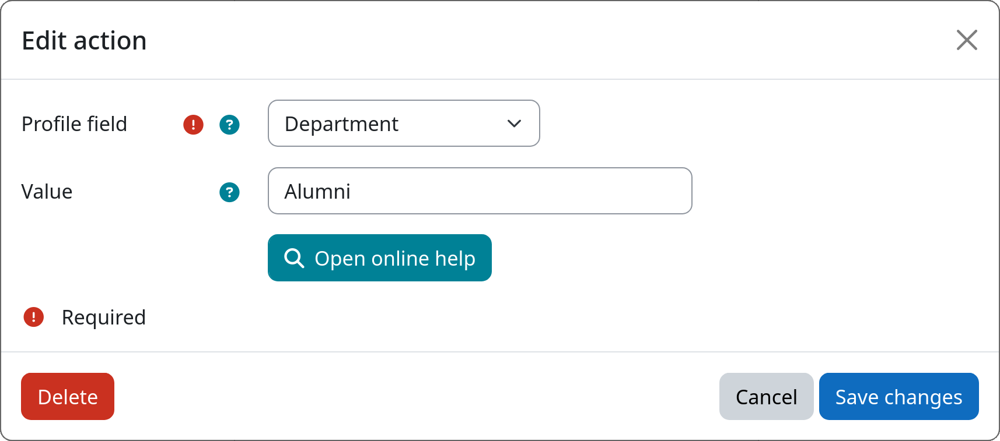

# Action: Set Profile Field

This action sets a user profile field to a configured value when a user enters a workflow step. This is useful for
marking, categorizing, or clearing user data as part of a lifecycle workflow — for example, clearing the department
field when a user is offboarded, or stamping an ID number field with a fixed value. Both standard Moodle user fields and
[custom profile fields](https://docs.moodle.org/en/User_profile_fields) are supported.

[:fontawesome-solid-user-pen: Set Profile Field](#){.md-button .md-button-subplugin .md-button-subplugin-action .md-button-disabled}

!!! danger "Risk of data loss"
    Setting or clearing profile field values is irreversible and will permanently replace the existing data within the
    targeted user account.

!!! info "Username and email address cannot be changed"
    Unconditionally altering the username or email address of a user account can have severe consequences and cause
    unintended behavior. Therefore, the username and email address fields are not available for selection in this action.

## Settings

!!! setting "Profile field"
    Select the profile field whose value should be set. The following standard Moodle user fields are available:

    - First name
    - Last name
    - ID number
    - Department
    - Institution
    - City / Town
    - Country

    All custom profile fields defined on the site are listed below the standard fields.

!!! setting "Value"
    Enter the value to set the selected profile field to. Leave the field empty to **clear** the profile field value.

## Example

