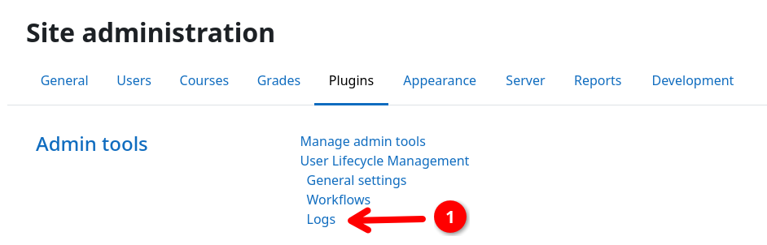

# Action Log

The action log allows you to audit what the plugin has done over time and how many user were affected by which workflows
and actions. Action log entries are always written whenever any action is executed during workflow processing.

## Inspecting the action log

You can access the action log by navigating to {{ moodle_nav_path('Site administration', 'Plugins') }}, scrolling down
to {{ moodle_nav_path('Admin tools', 'User Lifecycle Management') }} and selecting {{ moodle_nav_path('Logs') }} {{n1}}.
This will bring you to the action log page.

By default, actions from all workflows are shown in chronological order with the most recent actions at the top. You can
use the filter bar at the top to narrow down the shown log entries to a specific workflow or step.

{.img-thumbnail}
{.img-thumbnail}

## Understanding the users column

The action log is **aggregated**. A single entry represents one action being executed for a number of users during a
workflow run at a specific point in time.

For example, in a single workflow run, 25 users enter a step with a [send mail action](../actions/mail.md) directly
followed by a [suspend action](../actions/suspend.md). This will create two action log entries:

- (A) 25 users that got a mail, and
- (B) 25 users that got suspended.

Both entries will have the same timestamp, workflow, and step associated with them.
