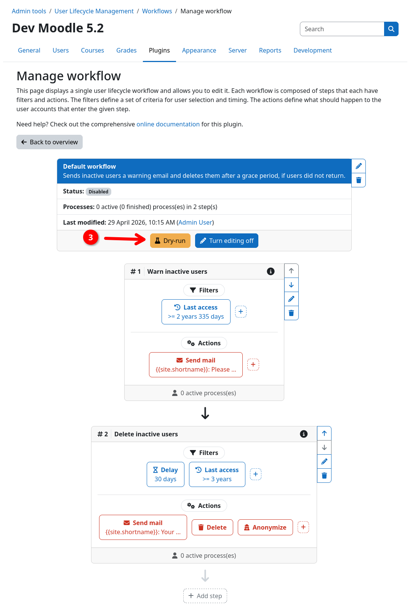
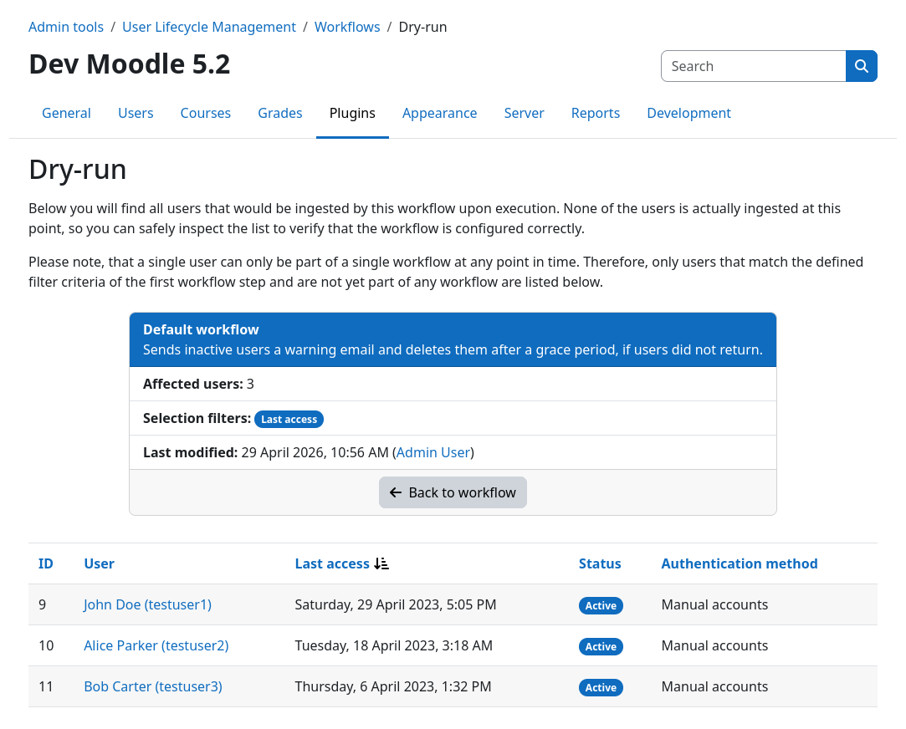

# Performing a dry-run

A dry-run is the safest way to verify that a workflows ingestion filters before enabling it. A dry-run shows you which
users would be ingested into the workflow if it would be enabled right now without executing any real action right now.

!!! warning "Dry-run only works for disabled workflows"
	You can only perform a dry-run for disabled workflows. If you want to verify the behavior of an active workflow, you
    can [inspect the user processes](userprocesses.md) or the [action log](actionlog.md) instead.

In order to perform a dry-run, execute the following steps:

1. Navigate to the workflow inspection page of the workflow you want to check.
2. Inside the workflow header {{n1}}, click the {{ moodle_nav_path('Turn editing on') }} button {{n2}} to enter edit mode.
3. Inside the workflow header, click the {{ moodle_nav_path('Dry-run') }} button {{n3}}.

This will take you to the dry-run page. Here you find a list of all users that would be ingested into the workflow,
based on the filter criteria of the first workflow step. By default, the list is sorted by the last access date of the
users, which is also displayed in the respective column. You can furthermore click on the respective users name to open
their profile page for further inspection.

{.img-thumbnail}
{.img-thumbnail}
{.img-thumbnail}

!!! info "Only users without active processes are shown"
    Since a user can only be part of a single workflow at any point in time, users that are already being processed by
    another workflow will never show up in the dry-run. For more details please refer to the
    [execution model](../workflow/execution.md) documentation.
