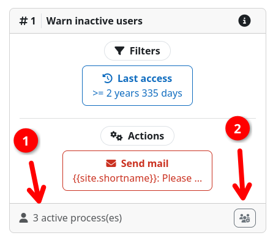

# Inspecting User Processes

Inspect the existing [user processes](../workflow/processes.md) to see which users are currently being processes by a
given workflow. This is especially useful when tracing delays, step transitions, or long-running workflows.

## Checking workflow statistics

The total number of active as well as finished user processes is displayed on the
[workflow overview page](../workflow/crud.md#create-sort-delete) as well as within the workflow header on the
[workflow inspection page](../workflow/crud.md#create-sort-delete). Look for the {{ moodle_nav_path('Processes') }}
column / field.

{.img-thumbnail}

## Inspecting active user processes

You can also inspect all user processes that are currently active within a respective workflows steps. This allows you
to see the exact users that are currently inside a workflow step.

To do so, open the workflow inspection page of the desired workflow. In the bottom row of each step you will find the
number of total active user processes {{n1}}. Clicking on the button in the bottom right corner {{n2}} opens a modal
dialog that shows a list of all user processes that are currently active in that step. You can see since when a user is
inside this step and inspect the users profile by clicking on the username.

{.img-thumbnail}
{.img-thumbnail}
