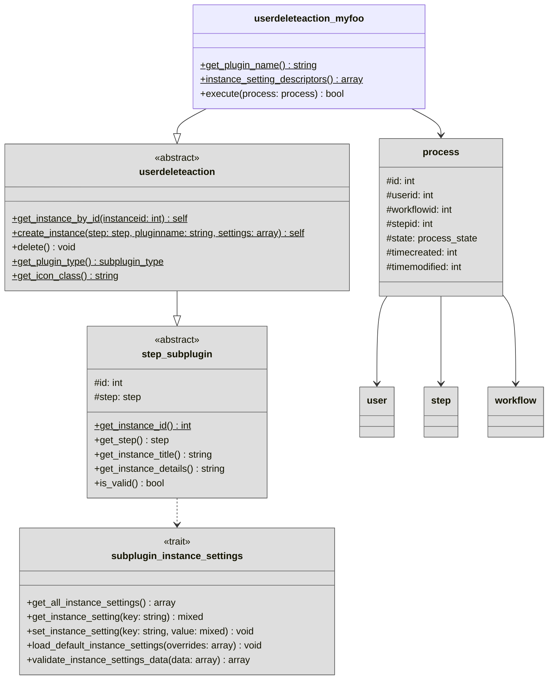

# Action subplugins

Actions are used to perform operations on Moodle users that enter a [workflow step](../workflow/steps.md). Actions are
always executed at the moment a user enters the workflow step the action is part of.

They are implemented as small subplugins and can therefore be easily extended by your own institution-specific actions.

## Overview

!!! info "Overview reduced for clarity"
    For clarity, the following overview diagram is reduced to the most important classes and members. Therefore, some
    details like methods, parameters, or members are omitted. Please refer to the {{ source_file('', 'plugin source code') }}
    for a complete reference.

## Implementation

All action subplugins must use the `userdeleteaction` frankenstyle plugin type and extend the abstract
{{ source_file('classes/userdeleteaction.php', '\\tool_userautodelete\\userdeleteaction') }} base class.

Any action subplugin must implement the following methods:

1. {{ source_file('classes/step_subplugin.php', 'get_plugin_name(): string') }}
2. {{ source_file('classes/userdeleteaction.php', 'execute(process: process): void') }}
3. {{ source_file('classes/local/trait/subplugin_instance_settings.php', 'instance_setting_descriptors(): array') }}
   (see also: [instance settings](instancesettings.md))

Of course you can also override other methods like {{ source_file ('classes/step_subplugin.php',
'get_instance_details(): string') }} or {{ source_file('classes/userdeleteaction.php',
'get_icon_class(): string') }} to further customize the behavior of your action subplugin and how it
displays within the UI.

!!! warning "PHPDocs are the ground source of truth"
    Please refer to the PHPDocs in the source code as the ground source of truth for detailed
    information regarding the implementation of these methods and their expected behavior.

!!! example "Example action subplugin implementations"
    You can find many examples of action subplugins directly within {{ source_file('action/') }}.
