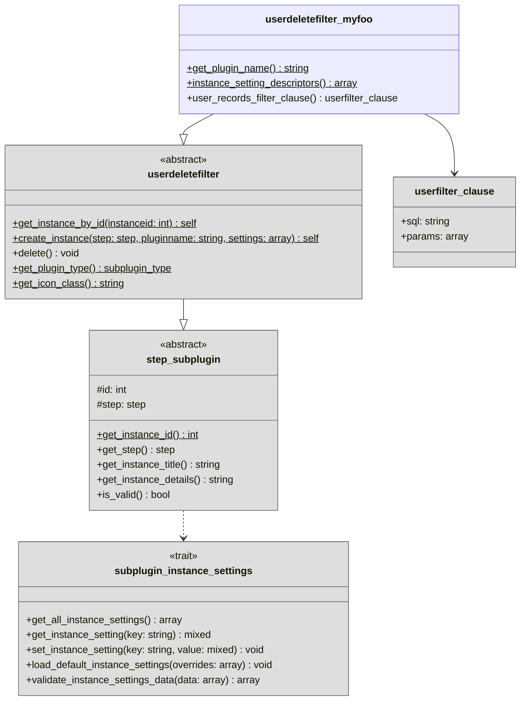

# Filter subplugins

Filters are used to select the Moodle users that are eligible to enter or transition between
[workflow steps](../workflow/steps.md). Each filter contributes a SQL `WHERE` clause fragment that is combined with
all other active filters via a logical `AND` to produce the final user selection query.

Filters are implemented as small subplugins and can therefore be easily extended by your own institution-specific filters.

## Overview

!!! info "Overview reduced for clarity"
    For clarity, the following overview diagram is reduced to the most important classes and members. Therefore, some
    details like methods, parameters, or members are omitted. Please refer to the {{ source_file('', 'plugin source code') }}
    for a complete reference.

## Implementation

All filter subplugins must use the `userdeletefilter` frankenstyle plugin type and extend the abstract
{{ source_file('classes/userdeletefilter.php', '\\tool_userautodelete\\userdeletefilter') }} base class.

Any filter subplugin must implement the following methods:

1. {{ source_file('classes/step_subplugin.php', 'get_plugin_name(): string') }}
2. {{ source_file('classes/userdeletefilter.php', 'user_records_filter_clause(): userfilter_clause') }}
3. {{ source_file('classes/local/trait/subplugin_instance_settings.php', 'instance_setting_descriptors(): array') }}
   (see also: [instance settings](instancesettings.md))

The `user_records_filter_clause()` method must return a
{{ source_file('classes/local/type/userfilter_clause.php', 'userfilter_clause') }} object that contains
a SQL `WHERE` clause fragment and the associated named parameters. All references to user table columns
**must** use the `u` table alias (e.g., `u.lastaccess`). All active filter clauses are joined with a SQL
`AND` operator at the time of evaluation.

You do not have to prefix your SQL parameter names in any way, as the core plugin will automatically
prefix them uniquely for you at the time of evaluation.

Of course you can also override other methods like {{ source_file('classes/step_subplugin.php',
'get_instance_details(): string') }} or {{ source_file('classes/userdeletefilter.php',
'get_icon_class(): string') }} to further customize the behavior of your filter subplugin and how it
displays within the UI.

!!! warning "PHPDocs are the ground source of truth"
    Please refer to the PHPDocs in the source code as the ground source of truth for detailed
    information regarding the implementation of these methods and their expected behavior.

!!! example "Example filter subplugin implementations"
    You can find many examples of filter subplugins directly within {{ source_file('filter/') }}.
