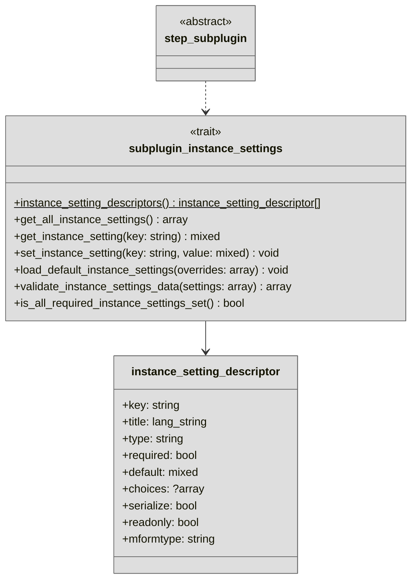

# Subplugin instance settings

Instance settings are the configuration values of a concrete action or filter instance inside a workflow step.
They are defined declaratively by each subplugin and are persisted as key-value entries in a shared plugin table.

The different settings a subplugin supports are defined via the static
{{ source_file('classes/local/trait/subplugin_instance_settings.php', 'instance_setting_descriptors(): array') }}
method and feed automatically in the instance settings form within the UI.


## Overview

!!! info "Overview reduced for clarity"
    For clarity, the following overview diagram is reduced to the most important classes and members. Therefore, some
    details like methods, parameters, or members are omitted. Please refer to the {{ source_file('', 'plugin source code') }}
    for a complete reference.

<div style="text-align: center;" markdown>



</div>


## Implementation

All action and filter subplugins inherit the
{{ source_file('classes/local/trait/subplugin_instance_settings.php', 'subplugin_instance_settings') }}
trait via the abstract {{ source_file('classes/step_subplugin.php', '\\tool_userautodelete\\step_subplugin') }}
base class. The instance settings trait provides runtime access, persistence in the database, default 
value loading, and validation.

The only method you must implement in your subplugin is:
{{ source_file('classes/local/trait/subplugin_instance_settings.php', 'instance_setting_descriptors(): array') }}.
 This method returns an array of {{ source_file ('classes/local/type/instance_setting_descriptor.php',
'instance_setting_descriptor') }} objects. Each descriptor defines one setting and defines various properties
of the setting.

!!! warning "PHPDocs are the ground source of truth"
    Please refer to the PHPDocs in the source code as the ground source of truth for detailed information regarding
    the effects and implementation details for all instance setting descriptor fields.


## Minimal Example

Here is a minimal example for a filter plugin `userdeletefilter_pattern` that defines a single instance setting
with the key `needle` as a text field:

```php
public static function instance_setting_descriptors(): array {
    return [
        new instance_setting_descriptor(
            key: 'needle',
            title: new lang_string('setting_needle', 'userdeletefilter_pattern'),
            type: PARAM_TEXT
        ),
    ];
}
```

!!! example "More complex reference implementations"
    Good real-world examples are available in
    {{ source_file('action/mail/classes/userdeleteaction.php') }},
    {{ source_file('filter/lastaccess/classes/userdeletefilter.php') }}, and
    {{ source_file('filter/auth/classes/userdeletefilter.php') }}


## Default values

If supplied via the `default` property of the instance setting descriptor, the default value of the setting will
be automatically loaded when a new instance of the respective subplugin is created. This way you can control if 
new instances of your subplugin are created with a pre-filled ready-to-use set of settings or if the user has to
fill in all settings from scratch.


## Marking fields as required or read-only

You can mark a field as **required** by setting the `required` property to `true`. This will mark any instance of
the respective subplugin as invalid if that field is not set and prevent users from saving the instance settings 
until a value for the required field is provided.

If you want to expose the value of a setting to the user but do not want to allow them to change it, you can mark
the field as **read-only** by setting the `readonly` property to `true`. This will render the field as disabled in
the UI and prevent users from changing its value.


## Serialization of multidimensional setting values

If you want to store non-scalar values like arrays or objects in your instance setting, you should make use of the
automated serialization. To do so, simply set the `serialize` property of the respective instance setting
descriptor to `true`. This will transparently serialize your complex data values and stores them as JSON in 
the database. During reads, the stored JSON is transparently deserialized and returned. 

This, for example, allows you to work natively with arrays instead of comma-separated lists if you have a
multi-select field:

```php
new instance_setting_descriptor(
    key: 'auths',
    title: new lang_string('setting_auths', 'userdeletefilter_auth'),
    type: PARAM_TEXT,
    required: true,
    default: ['manual'],
    choices: self::get_auth_plugins(),
    serialize: true,
    readonly: false,
    mformtype: 'autocomplete-multi'
);
```


## Controlling UI rendering

All declared instance settings are automatically exposed to the user via the
[instance settings form](../workflow/steps.md#manage-filters-and-actions) in the workflow editing UI. Under the
hood, the instance settings form is built using the Moodle form API. See
{{ source_file('classes/form/subplugin_instance_settings_form.php', 'subplugin_instance_settings_form') }} for
exact implementation details.

The used form element type is controlled by the `mformtype` property of the respective instance setting descriptor.
Please refer to the [Moodle Forms API Documentation](https://moodledev.io/docs/apis/subsystems/form#form-elements)
to determine the usable types.

{.img-thumbnail}
