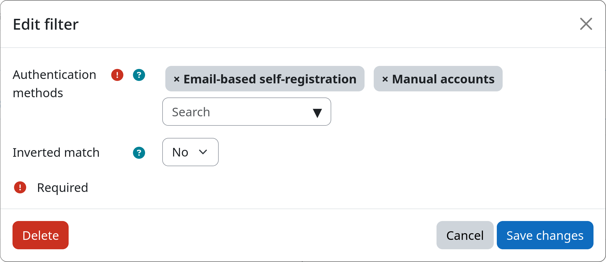

# Filter: Authentication Method

The authentication method filter allows you to select users based on the authentication method, i.e., the auth plugin,
they use when logging into you Moodle site. This is particularly useful for differentiating between users that are
managed locally on the Moodle site (e.g. manual accounts) and users that are managed externally (e.g. via LDAP or SAML).

[:fontawesome-solid-key: Authentication Method](#){.md-button .md-button-subplugin .md-button-subplugin-filter .md-button-disabled}

## Settings

!!! setting "Authentication methods"
    You can select one or more authentication methods from the list of available auth plugins on your Moodle site. Users
    that use one of the selected authentication methods will be selected by the filter. You can check the used
    authentication method for each user by inspecting their profile.

!!! setting "Inverted match"
    This setting allows you to invert the filter logic. If set to yes, all users with authentication methods that are
    **different from the above** selected authentication methods will be affected. If set to no, only users with one of
    the above selected authentication methods will be affected.

## Example

