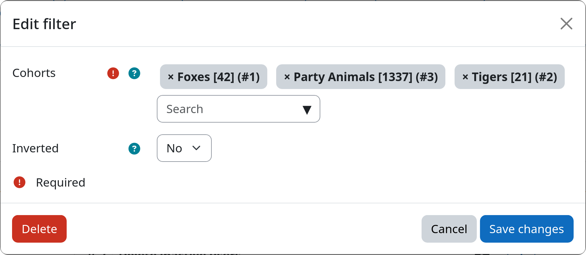

# Filter: Cohort Membership

The cohort filter allows you to select users based on their membership in one or more Moodle cohorts. Cohorts on both
system and course category level are supported. This is useful if you like to target a specific group of users (e.g. 
a specific semester group, a department, ...) that is defined as a cohort on your Moodle site.

[:fontawesome-solid-users: Cohort Membership](#){.md-button .md-button-subplugin .md-button-subplugin-filter .md-button-disabled}

## Settings

!!! setting "Cohorts"
    You can select one or more cohorts from the list of available cohorts on your Moodle site. Users that are members
    of **any of the selected cohorts** will be selected by the filter.

    Be aware, that you need to create cohorts via {{ moodle_nav_path('Site administration', 'Users', 'Cohorts') }}
    first, before you can access them inside this filter.

!!! setting "Inverted match"
    This setting allows you to invert the filter logic. If set to yes, all users that are **not members of any of the
    above selected cohorts** will be affected. If set to no, only users with membership in at least one selected cohort
    will be affected.

## Example

