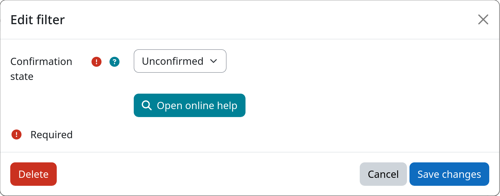

# Filter: Account Confirmation

The account confirmation filter allows you to select users based on whether their account has been confirmed.
An account is considered confirmed once the user has verified their email address after self-registration
(i.e. `mdl_user.confirmed = 1`). Other authentication methods will also set this value to `1`. An unconfirmed
account is unable to log in.

This filter is especially useful for removing accounts that were created but never activated. You can, for example,
delete all unconfirmed accounts earlier than active accounts.

[:fontawesome-solid-circle-check: Account Confirmation](#){.md-button .md-button-subplugin .md-button-subplugin-filter .md-button-disabled}

## Settings

!!! setting "Confirmation state"
    Select which users should be targeted based on their account confirmation state.

    If set to **Unconfirmed**, only users who have not yet confirmed their account will be affected.
    This is the default and the most common use-case, e.g. to clean up accounts created through
    self-registration that were never activated.

    If set to **Confirmed**, only users whose account is already confirmed will be affected.

## Example

