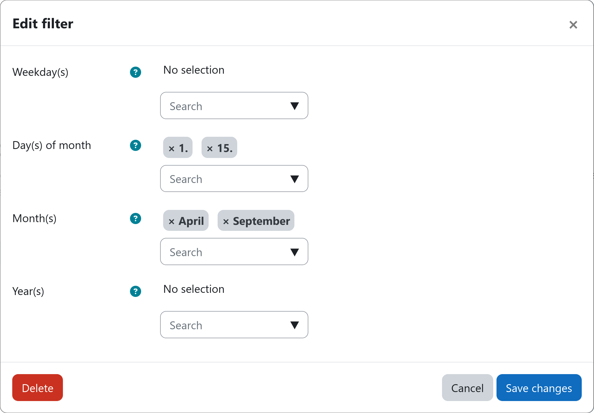

# Filter: Date

The date filter allows you to prevent users from transitioning to another step or from being ingested into a workflow
based on the current date. You can restrict workflow ingestion and step transitions to specific weekdays, days of the 
month, months, and years, e.g., only during April and September.

[:fontawesome-regular-calendar: Date](#){.md-button .md-button-subplugin .md-button-subplugin-filter .md-button-disabled}

!!! danger "Risk of data loss or unexpected behavior"
    The date filter does not evaluate user profile data. Instead, it only checks the current date and then either allows
    or blocks all user transitions for this step. If the date filter is used without any other filter inside a workflow,
    it will target all users regardless of their other attributes. If combined with destructive actions (e.g. delete
    user), this can lead to unintended consequences.

    Please **always combine the date filter with other filters** that narrow down the targeted users or use it **as a
    time gate in later steps** to avoid unintended consequences.

## Settings

The following date criteria are available for gating workflow ingestion and step transitions. At least one criterion
must be set for the filter to be valid. If multiple criteria are set, all criteria must be met for the filter to allow
users to pass.

!!! setting "Weekday(s)"
    Select one or more weekdays. If left empty, weekdays are ignored and all weekdays are allowed.

!!! setting "Day(s) of month"
    Select one or more days of a month. If left empty, days are ignored and all days are allowed.

!!! setting "Month(s)"
    Select one or more months. If left empty, months are ignored and all months are allowed.

!!! setting "Year(s)"
    Select one or more years. If left empty, years are ignored and all years are allowed.

## Combining criteria

This filter allows you to specify multiple date-base criteria that can be combined to create complex date-base rules.

### Using one criterion with a single value

In the simplest case, you set a single criterion, e.g., {{ moodle_nav_path('Weekday(s)') }}, to a single value, e.g.,
Sundays. To do so, select Sunday in the {{ moodle_nav_path('Weekday(s)') }} selector and leave all other criteria empty.

In this case, the filter will only allow users to proceed on Sundays. No specific combination rules apply. See the
example below:

!!! example "Example: Allowing users to proceed on Sundays only"

    

    

    |                                Criterion | Value                         |
    |-----------------------------------------:|:------------------------------|
    |      {{ moodle_nav_path('Weekday(s)') }} | Sunday                        |
    | {{ moodle_nav_path('Day(s) of month') }} | <small>*No selection*</small> |
    |        {{ moodle_nav_path('Month(s)') }} | <small>*No selection*</small> |
    |         {{ moodle_nav_path('Year(s)') }} | <small>*No selection*</small> |

    

    

    :material-calendar-check:{.lg .middle} **Allowed dates**

    - [x] Sunday, 04.01.2026
    - [x] Sunday, 11.01.2026
    - [x] Sunday, 18.01.2026
    - [x] Sunday, 25.01.2026
    - [x] Sunday, 01.02.2026
    - [x] Sunday, 08.02.2026
    

    

    :material-calendar-remove-outline:{.lg .middle} **Rejected dates**

    - [ ] Monday, 05.01.2026
    - [ ] Tuesday, 06.01.2026
    - [ ] Wednesday, 07.01.2026
    - [ ] Thursday, 08.01.2026
    - [ ] Friday, 09.01.2026
    - [ ] Saturday, 10.01.2026
    

    

### Using one criterion with multiple values

Multiple values within the same criterion are **combined with an OR logic**. In other words, if you select multiple
values for a single criterion, only one of the selected values needs to match for users to be allowed to proceed.

If you wish to alter the above example to allow users to proceed on workdays only, you would alter the value of the
{{ moodle_nav_path('Weekday(s)') }} selector to include all workdays (Monday to Friday), leaving Saturday and Sunday out
of your selection. See the example below:

!!! example "Example: Allowing users to proceed only on workdays"

    

    

    |                                Criterion | Value                         |
    |-----------------------------------------:|:------------------------------|
    |      {{ moodle_nav_path('Weekday(s)') }} | Mon, Tue, Wed, Thu, Fri       |
    | {{ moodle_nav_path('Day(s) of month') }} | <small>*No selection*</small> |
    |        {{ moodle_nav_path('Month(s)') }} | <small>*No selection*</small> |
    |         {{ moodle_nav_path('Year(s)') }} | <small>*No selection*</small> |

    

    

    :material-calendar-check:{.lg .middle} **Allowed dates**

    - [x] Monday, 05.01.2026
    - [x] Tuesday, 06.01.2026
    - [x] Wednesday, 07.01.2026
    - [x] Thursday, 08.01.2026
    - [x] Friday, 09.01.2026
    - [x] Monday, 12.01.2026
    

    

    :material-calendar-remove-outline:{.lg .middle} **Rejected dates**

    - [ ] Saturday, 10.01.2026
    - [ ] Sunday, 11.01.2026
    - [ ] Saturday, 17.01.2026
    - [ ] Sunday, 18.01.2026
    - [ ] Saturday, 24.01.2026
    - [ ] Sunday, 25.01.2026
    

    

### Using multiple criteria with multiple values

When you set values for multiple criteria, e.g., {{ moodle_nav_path('Month(s)') }} and
{{ moodle_nav_path('Day(s) of month') }}, the **criteria are combined with an AND logic** while the selected values
inside the criteria themselves are still combined with the above describe OR logic. This means, that the current date
must match at least one of the selected values in each of the active criteria for users to be allowed to proceed.

One example would be only deleting inactive users twice a year during semester breaks in March and September. To achieve
this, you would set the {{ moodle_nav_path('Month(s)') }} selector to March and September and the
{{ moodle_nav_path('Day(s) of month') }} selector to the days during which the deletion should be allowed, e.g., 1st to
15th of the month. 

!!! example "Example: Allowing users to proceed only on the 1st and 15th of March and September"

    

    

    |                                Criterion | Value                         |
    |-----------------------------------------:|:------------------------------|
    |      {{ moodle_nav_path('Weekday(s)') }} | <small>*No selection*</small> |
    | {{ moodle_nav_path('Day(s) of month') }} | 1st, 15th                      |
    |        {{ moodle_nav_path('Month(s)') }} | March, September              |
    |         {{ moodle_nav_path('Year(s)') }} | <small>*No selection*</small> |

    

    

    :material-calendar-check:{.lg .middle} **Allowed dates**

    - [x] Sunday, 01.03.2026
    - [x] Sunday, 15.03.2026
    - [x] Tuesday, 01.09.2026
    - [x] Tuesday, 15.09.2026
    - [x] Monday, 01.03.2027
    - [x] Monday, 15.03.2027
    

    

    :material-calendar-remove-outline:{.lg .middle} **Rejected dates**

    - [ ] Thursday, 01.01.2026
    - [ ] Saturday, 28.02.2026
    - [ ] Monday, 02.03.2026
    - [ ] Wednesday, 18.03.2026
    - [ ] Monday, 06.04.2026
    - [ ] Wednesday, 30.09.2026
    

    

## Example

