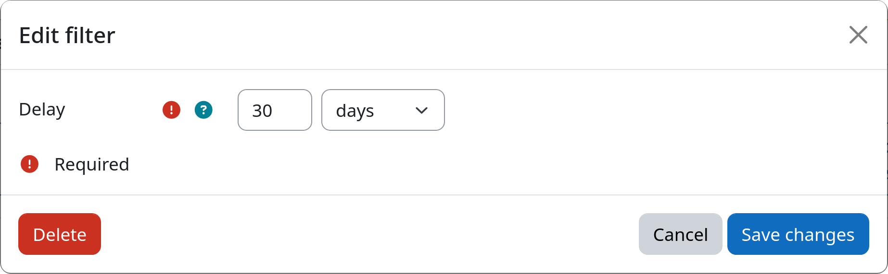

# Filter: Time Delay

The time delay filter allows you to delay transitions between workflow steps by requiring that a user process has
already spent a minimum amount of time in the previous step. This is useful if you want to enforce waiting periods
before executing follow-up actions, e.g., when sending the user a warning email and waiting for a response before taking
further actions.

[:fontawesome-solid-hourglass: Time Delay](#){.md-button .md-button-subplugin .md-button-subplugin-filter .md-button-disabled}

!!! warning "Do not use in first step of a workflow"
    The time delay filter checks how much time a user process has already spent in the previous step. Therefore it will
    **never select any users** for ingestion **into the workflows first step**, as there is no previous step for the user
    processes to spend time in.

    If you want to check how long a user has been inactive on your Moodle site before ingesting them into the workflow,
    please use the [last access filter](lastaccess.md) instead!

## Settings

!!! setting "Delay"
    Defines the minimum amount of time a user process has to stay in the previous step before it is allowed to
    transition to the step this filter is part of.

## Example

