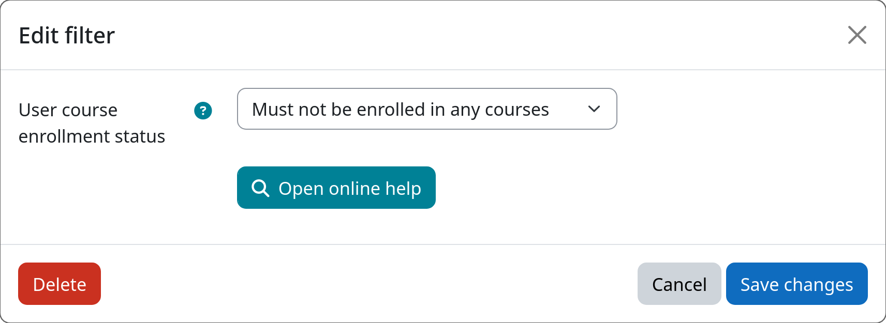

# Filter: Course Enrolment

The course enrolment filter allows you to select users based on whether they are currently enrolled in at least one
course or not. This is useful, for example, when you want to automatically delete accounts that are not part of any
course anymore, or to protect users who are still actively participating in courses from being removed.

[:fontawesome-solid-graduation-cap: Course Enrolment](#){.md-button .md-button-subplugin .md-button-subplugin-filter .md-button-disabled}

## Settings

!!! setting "User course enrollment status"
    Select whether this filter should match users who **are** enrolled in at least one course, or users who are
    **not** enrolled in any course.

    If set to _"Must be enrolled in at least one course"_, only users with **at least one active enrolment** will be affected.

    If set to _"Must not be enrolled in any courses"_, only users **without any enrolment** will be affected.

## Example

