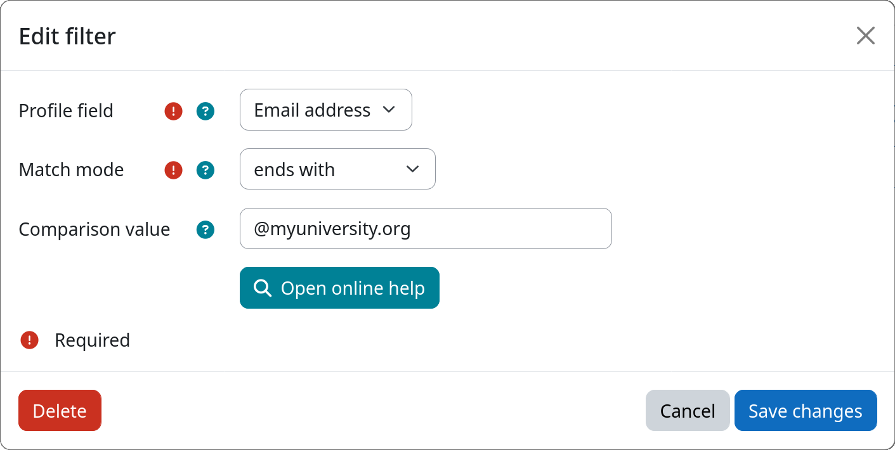

# Filter: Profile Field

The profile field filter allows you to select users based on the value of a specific user profile field. Both standard
Moodle profile fields (such as name, email, or idnumber) as well as [custom profile fields](https://docs.moodle.org/en/User_profile_fields)
are supported. This makes it easy to target users based on any attribute stored in their profile.

[:fontawesome-regular-id-card: Profile Field](#){.md-button .md-button-subplugin .md-button-subplugin-filter .md-button-disabled}

!!! info "Combining multiple profile field conditions"
    To filter users based on multiple profile fields simultaneously, add one filter instance per field to the same
    workflow step. All filters inside a single step are combined with a logical AND. See [workflow execution model](../workflow/execution.md)
    for more details.

## Settings

!!! setting "Profile field"
    Select the user profile field whose value should be checked by this filter.

    The following standard fields are available: Full name, First name, Last name, Nickname, ID number, Email address,
    Department, Institution, City / Town, and Country.

    In addition, all globally defined  [custom profile fields](https://docs. moodle.org/en/User_profile_fields) will be
    available.

!!! setting "Match mode"
    Select how the profile field value is compared against the configured comparison value (see below):

    | Mode | Description |
    |---|---|
    | **contains** | Field value contains the comparison value (case-insensitive) |
    | **does not contain** | Field value does not contain the comparison value |
    | **is equal to** | Field value exactly matches the comparison value (case-insensitive) |
    | **is not equal to** | Field value does not match the comparison value |
    | **starts with** | Field value begins with the comparison value |
    | **ends with** | Field value ends with the comparison value |
    | **is empty** | Field value is empty or not set |
    | **is not empty** | Field value is set and not empty |

!!! setting "Comparison value"
    The string to compare the profile field value against. Not required for the **is empty** and **is not empty** match
    modes.

## Example

