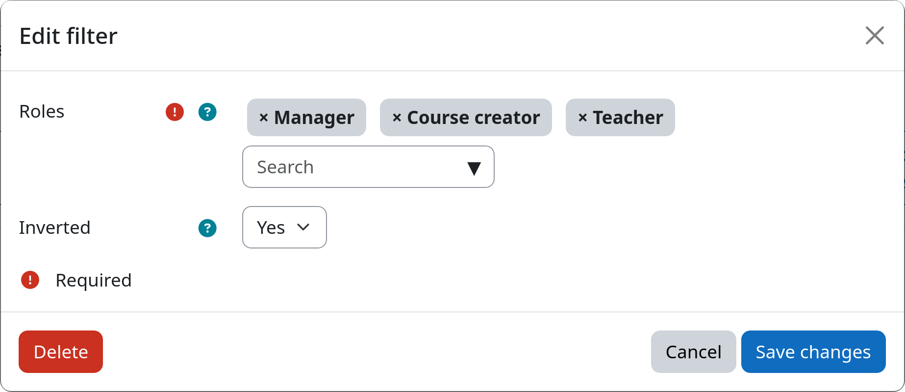

# Filter: Role Assignment

The role assignment filter allows you to select users based on their assigned Moodle roles. This is useful when you want
to apply lifecycle rules to specific user groups such as students, teachers, or managers. You can furthermore use this
filter to target all users expect those with specific roles, e.g., to exclude teachers.

[:fontawesome-solid-user-tag: Role Assignment](#){.md-button .md-button-subplugin .md-button-subplugin-filter .md-button-disabled}

!!! warning "Role assignments are context agnostic"
    This filter checks for the presence of the selected roles in **any context** of your Moodle site. This means that it
    does not matter whether a user has a specific role assigned on system, category, or course level. If a user
    has at least one of the selected roles assigned in any context, it will be selected by the filter.

## Settings

!!! setting "Roles"
    You can select one or more roles from the list of available Moodle roles. Users that have **at least one of the
    selected roles** assigned in any context will be selected by the filter.

!!! setting "Inverted match"
    This setting allows you to invert the filter logic. If set to yes, all users with **none of the above selected
    roles** assigned will be affected. If set to no, only users with at least one of the selected roles will be affected.

## Example

