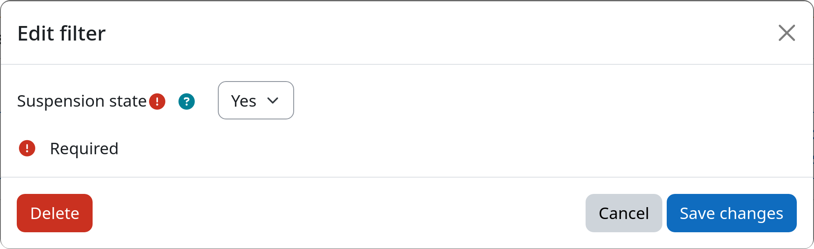

# Filter: Suspension State

The suspension state filter allows you to select users based on whether their account is currently suspended or active.
This can be useful if your users get suspended by an external sync task (i.e. LDAP sync) and you want to
automatically delete them after a specified period of time.

[:fontawesome-solid-user-slash: Suspension State](#){.md-button .md-button-subplugin .md-button-subplugin-filter .md-button-disabled}

## Settings

!!! setting "Suspension state"
    Select whether this filter should match suspended users or active (not suspended) users.

    If set to yes, only suspended users will be affected.
    If set to no, only active users will be affected.

## Example

