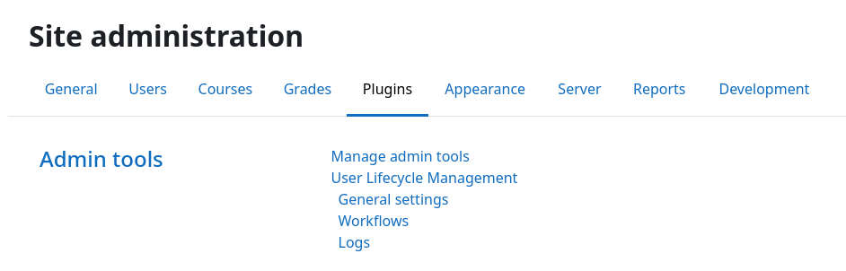

# Installation

This plugin can be installed like any other Moodle plugin by placing its source code inside your Moodle installation and
executing the upgrade routine afterward.


!!! warning "Prerequisites"
    Before installing, ensure you have:

    - Administrator access to your Moodle site
    - Moodle 4.5 (LTS) or later installed
    - PHP 8.1 or later installed


## Installing via the site administration (uploaded ZIP file)

1. Download the latest release of this plugin from the [Moodle plugin directory](https://marketplace.moodle.com/plugins/tool_userautodelete).
2. Log in to your Moodle site as an admin and go to {{ moodle_nav_path('Site administration', 'Plugins', 'Install plugins') }}.
3. Upload the ZIP file with the plugin code.
4. Check the plugin validation report and finish the installation.


## Installing manually

The plugin can be also installed by putting the contents of this directory into

```
{your/moodle/dirroot}/admin/tool/userautodelete
```

!!! note "New public directory for Moodle 5.1+"
    If you're installing on Moodle 5.1 or later, the plugin code must be placed in the `public/` directory of your
    Moodle installation. The full installation path becomes: `{your/moodle/dirroot}/public/admin/tool/userautodelete`.

    See the [Moodle 5.1 upgrading notes](https://docs.moodle.org/501/en/Upgrading#Code_directories_restructure) for more details.

Afterwards, log in to your Moodle site as an admin and go to {{ moodle_nav_path('Site administration', 'Notifications') }} to complete the
installation.

Alternatively, you can run `php admin/cli/upgrade.php` from the command line to complete the installation.


## Verifying installation

To verify the plugin installed correctly:

1. Go to {{ moodle_nav_path('Site administration', 'Plugins', 'Plugins overvieww') }}.
2. Scroll down to the "Admin tools" section.
3. Verify that "User Lifecycle Management" is listed and shows a valid version number.

You can also navigate to {{ moodle_nav_path('Site administration', 'Plugins') }}, scroll down to "Admin tools",
and validate that the plugin settings page exists:

{.img-thumbnail}


## Next step

Installation is complete! Now it's time to [create your first workflow](workflow.md).

[:fontawesome-solid-sitemap: Create Workflow](workflow.md){.md-button}
