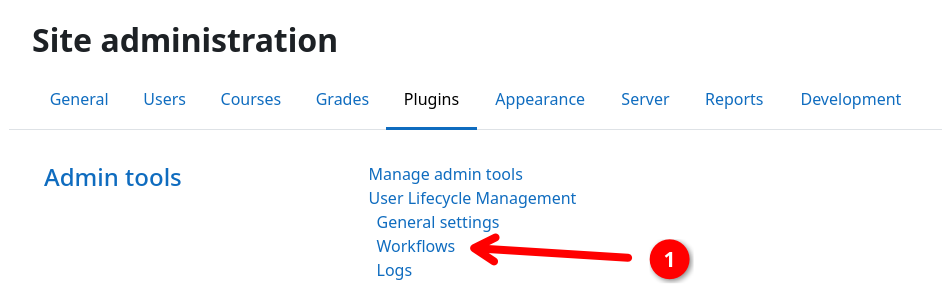
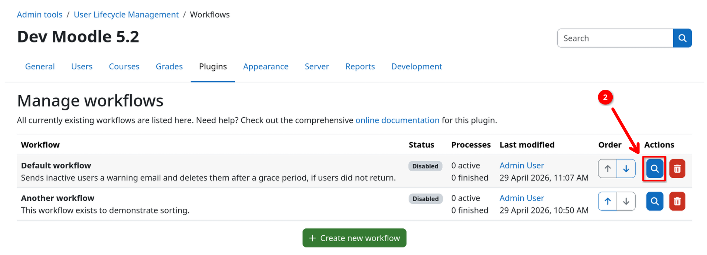
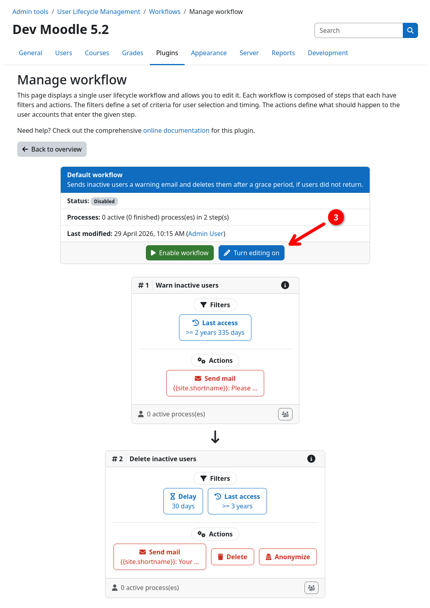
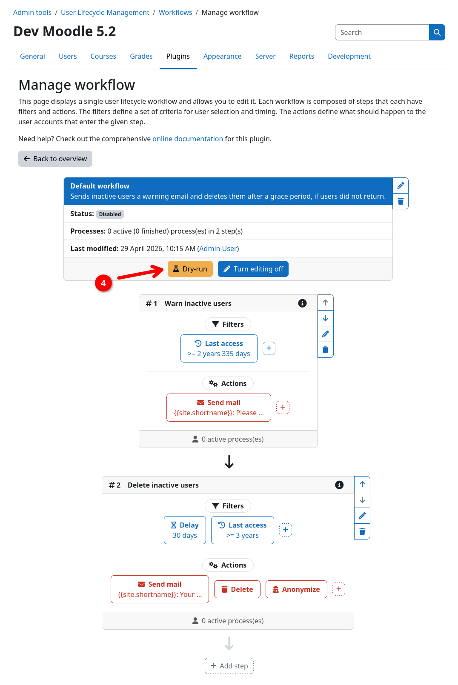
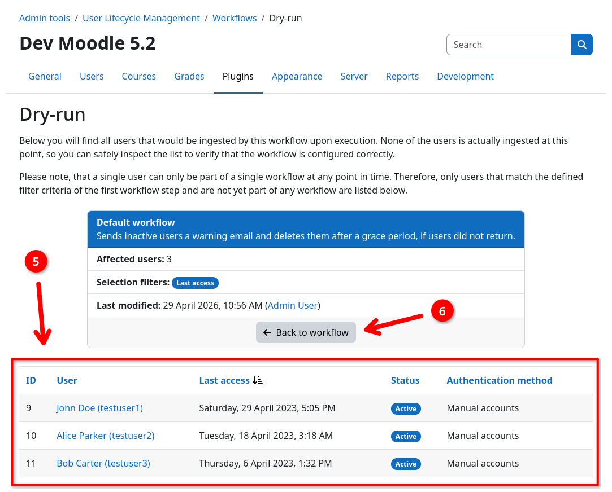
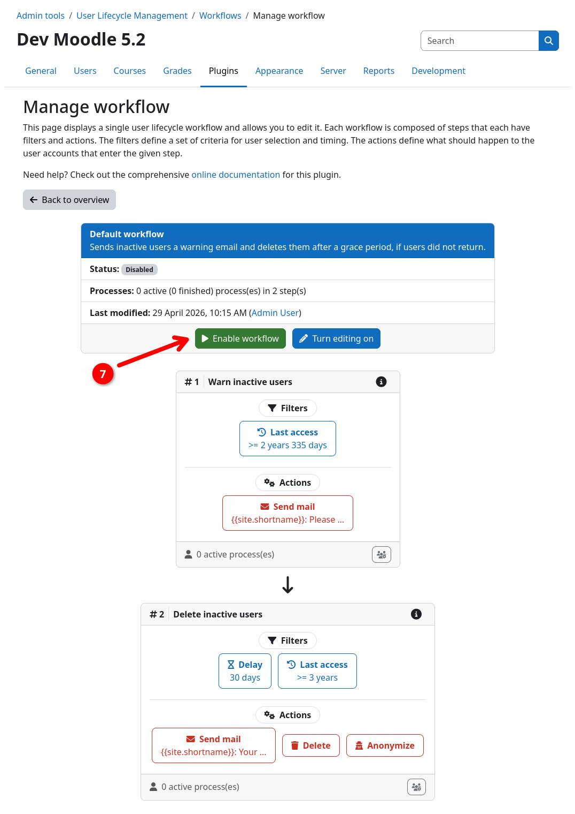
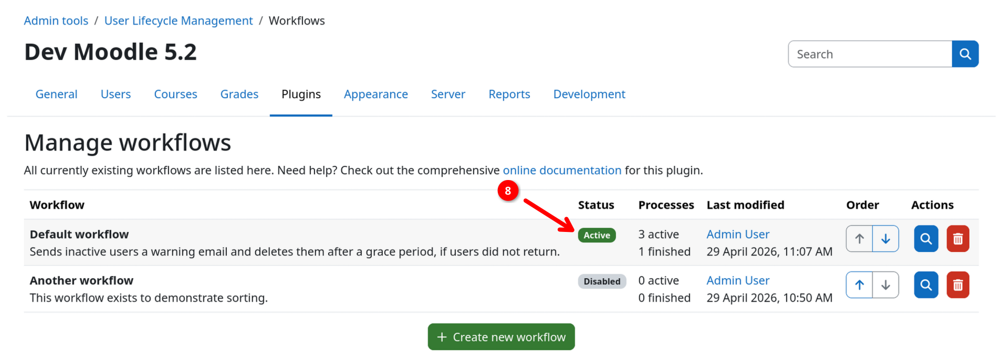
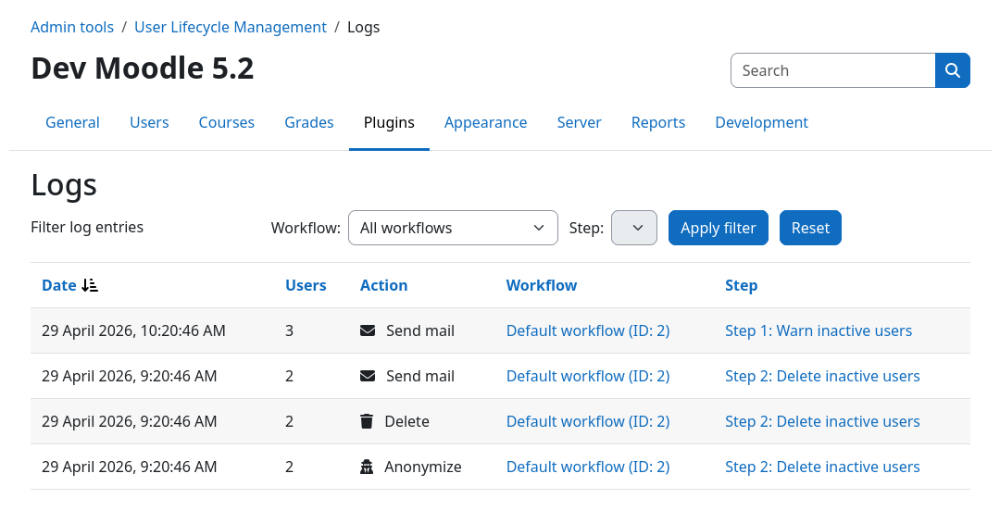

# Verifying and Enabling Your Workflow

Before enabling a workflow, you should always verify that it targets the desired users. This plugin provides both a
[dry-run mode](../audit/dryrun.md) to verify targeted user before enabling a workflow and an
[action log](../audit/actionlog.md) to trace all actions performed by the plugin.

This section will show you how to perform a dry-run, enable a workflow, and monitor the workflow's activity via the
action log.

## (1) Opening the workflow details page

1. Sign in to your Moodle site as an administrator.
2. Navigate to {{ moodle_nav_path('Site administration', 'Plugins') }}.
3. Scroll down and click on {{ moodle_nav_path('Admin tools', 'User Lifecycle Management', 'Workflows') }} {{ n1 }}.
4. Open your previously create workflow by clicking on the inspection button {{ n2 }}.

{.img-thumbnail}
{.img-thumbnail}

## (2) Performing a dry-run

!!! success "This is a safe operation"
	The dry-run mode is a safe operation that does not perform any real actions. It only simulates which users the
    workflow would ingest if you were to enable the workflow right now.

1. Enable edit mode by clicking on {{ moodle_nav_path('Turn editing on') }} {{ n3 }} in the workflow header.
2. Go to the dry-run page by clicking on {{ moodle_nav_path('Dry-run') }} {{ n4 }} in the workflow header.
3. Check the list of users {{ n5 }} matches your expectations. You can click on the usernames to open their profiles 
   and inspect them in more detail.

Note that only users that match the filters of the first step of your workflow will be shown. This is due to the fact
that users already have to be part of the workflow (i.e. have to be ingested by the workflow) to be processed by later
steps.

{.img-thumbnail}
{.img-thumbnail}
{.img-thumbnail}

## (3) Enabling the workflow

!!! danger "Risk of user data loss"
	_This is not a drill - Enabling the workflow actually enables the workflow ... D'oh!_

    Marking the workflow as active via {{ moodle_nav_path('Enable workflow') }} will start the automated user lifecycle
    management. This can lead to <b>users directly being processed</b> by your workflow.

1. Return to the workflow details page and disabled edit mode by clicking on {{ moodle_nav_path('Turn editing off') }}
   {{ n6 }} in the workflow header.
2. Enable the workflow by clicking on {{ moodle_nav_path('Enable workflow') }} {{ n7 }} in the workflow header.
3. Return to the workflow overview page and assert that the workflow status {{ n8 }} is now "Active".

Your workflow will now be automatically processed by a scheduled task in the background. Depending on your configuration,
it will take some time until the workflow is run for the first time.

{.img-thumbnail}
{.img-thumbnail}
{.img-thumbnail}

## (4) Inspecting the action log

If your workflow did run and performed some actions, these will be listed in the [action log](../audit/actionlog.md).
To inspect the action log, perform the following steps:

1. Navigate to {{ moodle_nav_path('Site administration', 'Plugins') }}.
2. Scroll down and click on {{ moodle_nav_path('Admin tools', 'User Lifecycle Management', 'Action log') }}.
3. (Optional) Use the filter bar to narrow down the list of actions.

{.img-thumbnail}

## That's it, you completed the quickstart guide!

Yeah! You successfully installed the plugin, created your first workflow, verified it using dry-run mode, and finally
got it up and running 🚀

If you wish to learn more about the plugin's features and how to use them, check out the rest of the documentation. Here
are some recommended places to start:

[:fontawesome-solid-sitemap: Workflows](../workflow/index.md){.md-button}
&nbsp;&nbsp;&nbsp;
[:fontawesome-solid-filter: Filters](../filters/index.md){.md-button}
&nbsp;&nbsp;&nbsp;
[:fontawesome-solid-gears: Actions](../actions/index.md){.md-button}

Found anything funny on the way or still having questions? Don't hesitate to ask for help or report any issues you
encounter via the [issue tracker](https://github.com/ngandrass/moodle-tool_userautodelete/issues) over on GitHub.

[:material-bug: Issue Tracker](https://github.com/ngandrass/moodle-tool_userautodelete/issues){.md-button}
