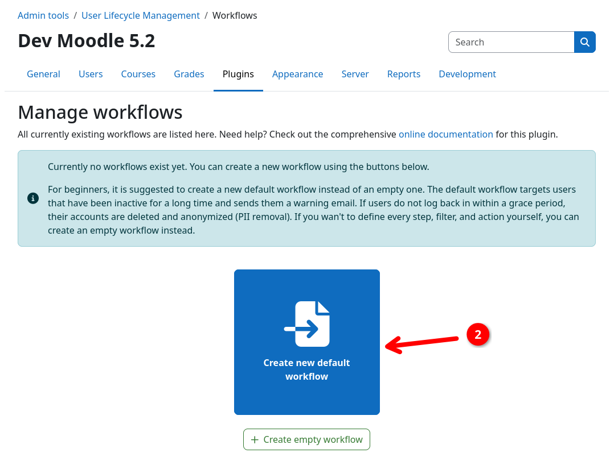
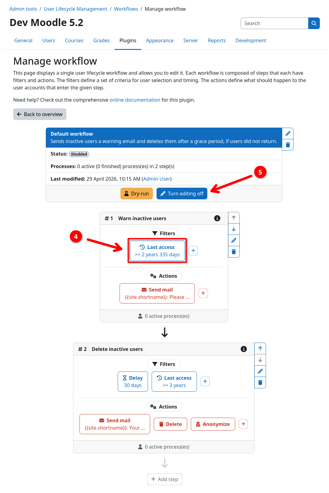

# Creating Your First Workflow

A workflow is the core of the user lifecycle management. It consists of one or more steps that have user filters and
actions to perform, whenever a user matches the filter criteria. Users process trough workflows in the form of, so called, user
processes.

For the sake of simplicity, we keep this quickstart guide short. You can find an in-depth description of all workflow
components and how they interact in the [Workflows section](../workflow/index.md) of this documentation.

!!! example "What we will build"
    A simple workflow that first sends a [warning mail](../actions/mail.md) to users who haven't accessed the site for a
    long time. If users haven't returned to the site after a grace period, they will receive a final 
    [deletion notice](../actions/mail.md) via mail, and their accounts will be [deleted](../actions/delete.md) and
    [stripped from all personal data](../actions/anonymize.md) in a GDPR-compliant way.
    

## (1) Navigating to the workflow management page

1. Sign in to your Moodle site as an administrator.
2. Navigate to {{ moodle_nav_path('Site administration', 'Plugins') }}.
3. Scroll down and click on {{ moodle_nav_path('Admin tools', 'User Lifecycle Management', 'Workflows') }} {{ n1 }}.

{.img-thumbnail}

## (2) Creating a new default workflow

1. Click on the {{ moodle_nav_path('Create new default workflow') }} button {{ n2 }}.

You will be redirected to the workflow inspection page, where you can see the workflow's steps, filters, and actions.

{.img-thumbnail}

## (3) Inspecting the workflow and changing steps

!!! info "Optional"
    This step is optional. You can skip it if you do not want to customize the default workflow.

1. Inspect the default workflow and its steps with the respective filters and actions.
2. Clicking the {{ moodle_nav_path('Turn editing on') }} button {{ n3 }} allows you to edit the workflow.
3. You can adjust filters and actions by clicking on them {{ n4 }}. This will open a form where you can change its
   settings.
4. Leave the edit mode by clicking {{ moodle_nav_path('Turn editing off') }} {{ n5 }}.

{.img-thumbnail}
{.img-thumbnail}

!!! danger "Risk of user data loss"
    _This is not a drill - Enabling the workflow actually enables the workflow ... D'oh!_

    Marking the workflow as active via {{ moodle_nav_path('Enable workflow') }} will start the automated user lifecycle
    management. This can lead to <b>users directly being processed</b> by your workflow. Make sure to verify that
    everything is correct using [dry-run mode](verification.md) (next step in this guide) before enabling the workflow.

## Next step

Your workflow is created successfully! Now [verify that it works correctly](verification.md) using dry-run mode.

[:material-check-circle: Verify Actions](verification.md){.md-button}
