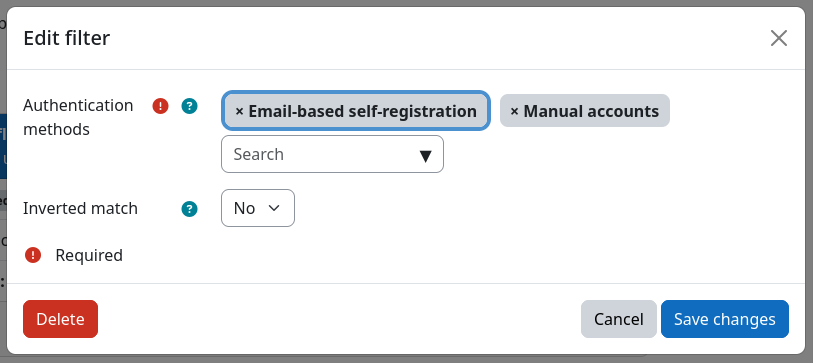
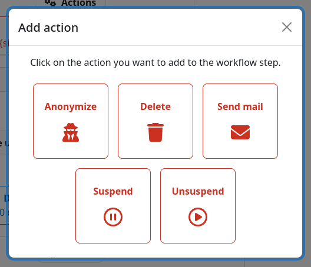
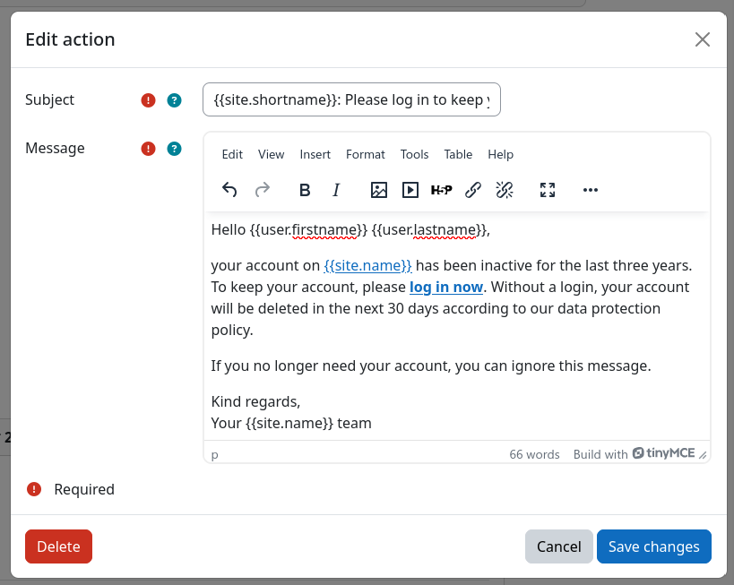

# Screenshots

This page contains various screenshots of the plugin. The screenshots shown here do not cover the full depth of the
plugin's functionality, but they should give you a good first impression of the plugin and its features.

!!! info "Screenshots not indicative of all features"
    The screenshots shown show the base features of this plugin. They might not cover all available filters or actions,
    and they do not show any custom filters or actions that might be available on your site. Please check the respective
    documentation for details on the available filters and actions.

## Workflows overview page

## Definition of a single workflow

## Adding a new filter to a workflow step

## Editing a filter instance

## Adding a new action to a workflow step

## Editing an action instance

## Performing a dry-run for a workflow

## Inspecting the action log

