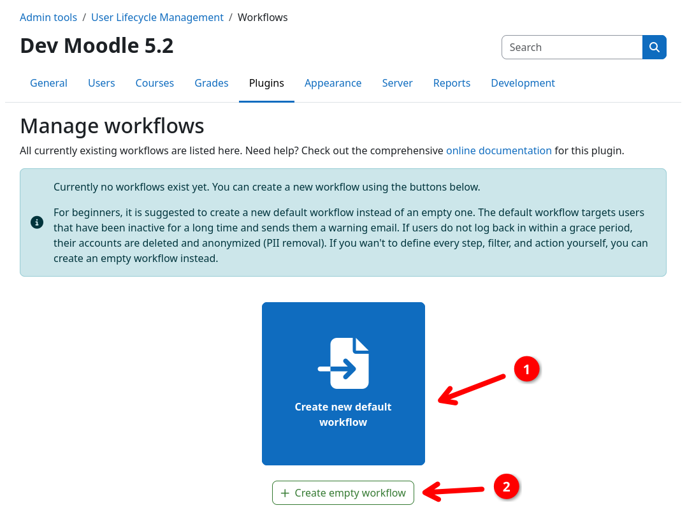
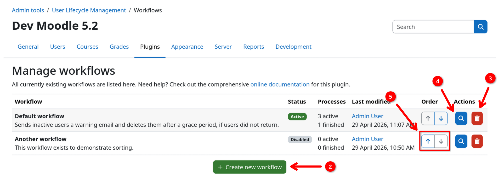
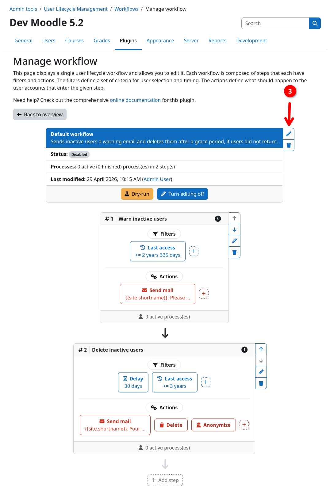
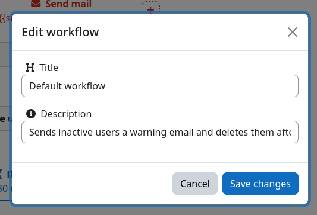
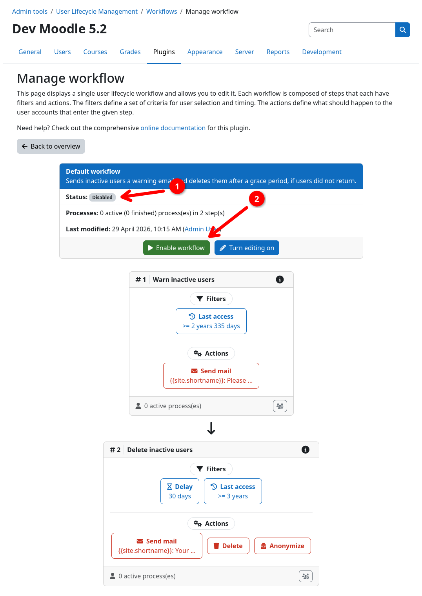
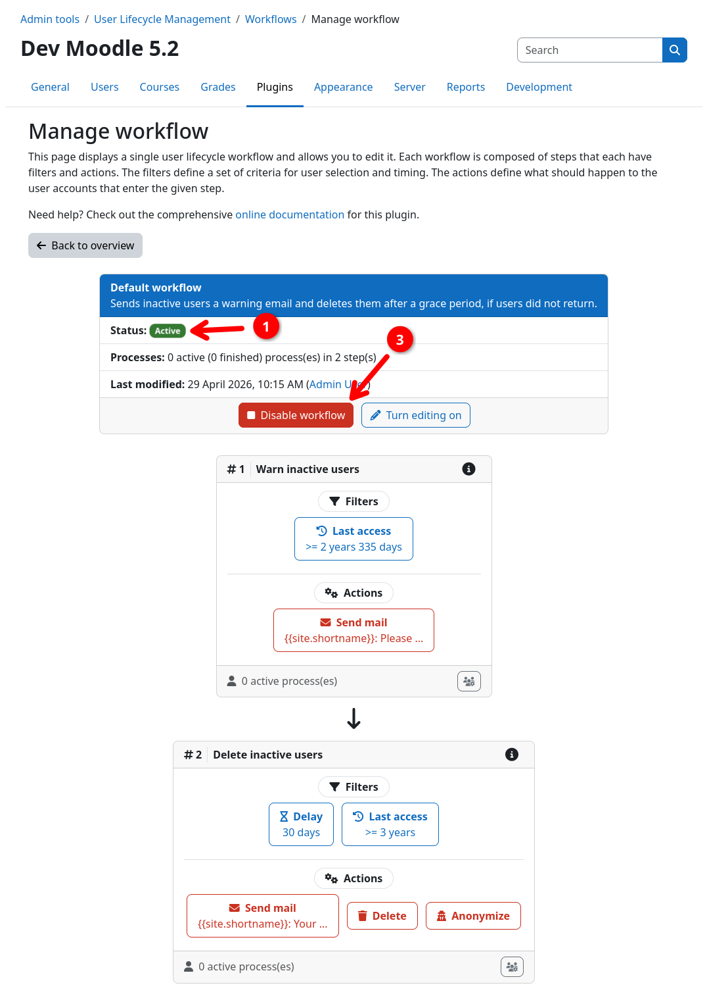

# Workflow Management

You can access and manage all workflows via the plugins admin interface. For workflows, the following pages are relevant:

- The **workflows** page lists all workflows and their status.
- The **workflow inspection** page shows one workflow with all of its steps, filters, and actions.

You can access the workflow overview via {{ moodle_nav_path('Site administration', 'Plugins', 'Admin tools', 'User Lifecycle Management', 'Workflows') }}.

## Create, sort, delete

The workflow table shows all existing workflows. You can create and delete all workflows via the
{{ moodle_nav_path('...', 'User Lifecycle Management', 'Workflows') }} page.

If you have no workflows yet, you can choose between the following options to create your first workflow:

- **Create new default workflow** {{n1}}: creates a ready-to-use workflow that warns inactive users first and deletes
  them after a grace period.
- **Create empty workflow** {{n2}}: creates a blank workflow.

You can **delete** workflows by using the trashcan button {{n3}} or **inspect and edit** the steps, filters, and actions of a
workflow via the respective inspection button {{n4}}.

The execution order / priority of a workflow can be changed via the up and down buttons {{n5}}. For more details on the
execution order, see the [execution model page](execution.md).

{.img-thumbnail}
{.img-thumbnail}

## Edit settings

To edit a workflow, navigate to its inspection page by clicking the respective button on the overview page (see above).

By default, the workflow opens in read-only mode. You can inspect all workflow details in the header section {{n1}}. To
perform any changes, please enable the edit mode {{n2}} first. You can then use the actions buttons to the right of the
workflow header {{n3}} to edit the workflow title and description.

{.img-thumbnail}
{.img-thumbnail}
{.img-thumbnail}

!!! info "Editing steps, filters, and actions"
	Editing steps and its components is covered in detail on the [steps page](steps.md):

    [:fontawesome-solid-list-check: Steps](steps.md){.md-button}
	

## Enable and disable

Workflows are always in a disabled state. In order for a workflow to perform any action it needs to be enabled first.
The current status of a workflow is indicated by the status column on the workflow overview page as well as by the
status field in the workflow header {{n1}}.

You can enable a workflow by opening the workflow inspection page and clicking the enable button {{n2}}. You can disable
an active workflow via the same button, which then turns into a disable button {{n3}}.

{.img-thumbnail}
{.img-thumbnail}

!!! info "Only valid workflows can be enabled"
    A workflow must be considered as valid before it can be enabled. This means, that it must contain at least one step,
    and all steps must contain at least one filter and one action. Invalid parts of your workflow are highlighted in the
    UI by a yellow border and a yellow warning icon.

!!! danger "Risk of data loss"
    Enabling a workflow allows users to be processed by your workflow. Please always make sure to verify your workflow
    with a [dry-run](../audit/dryrun.md) before enabling it.
