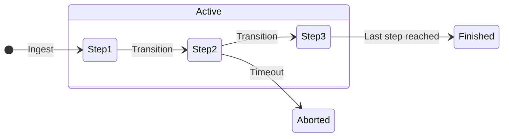
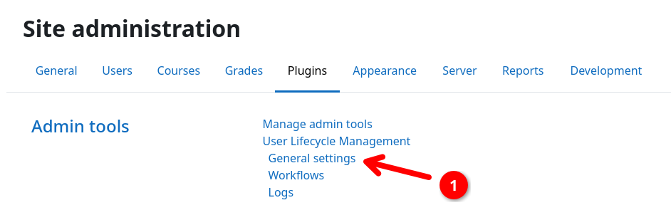
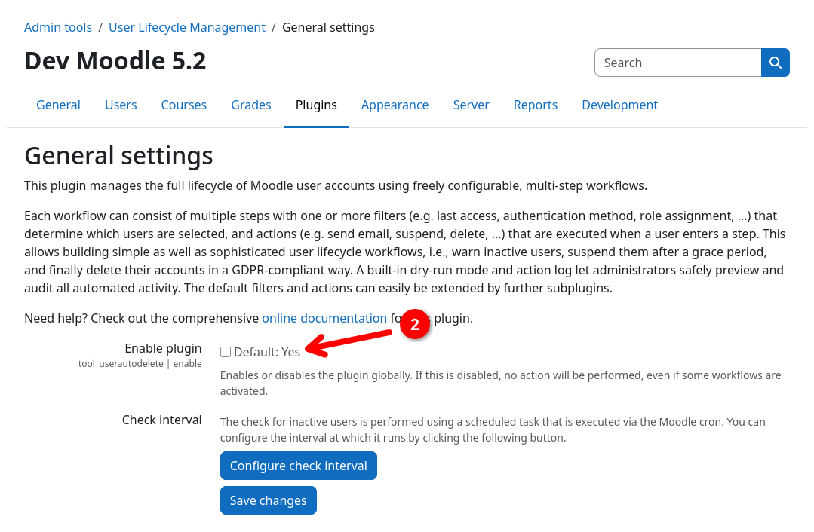

# Execution Model

This page describes how workflows are executed and how user processes move through the different workflow steps.
Understanding the execution model is crucial for designing workflows that work as intended and for troubleshooting
unexpected behavior.

The following diagram gives a simplified overview of the lifecycle of a single [user process](processes.md). The
different stages and conditions are explained in the following sections.

## Ingesting users into workflows

For all active workflows, existing users are [checked periodically](#time-of-execution) to determine if they are
eligible for ingestion into a workflow. For a user to be infested into a workflow, all the following criteria must be
met:

1. The user must **not be deleted**.
2. The user must **match all filter conditions** of the first step of the checked workflow.
3. The user must have **no active user process** in any workflow.

User ingestion is always performed directly after the [transitions between workflow steps](#transitioning-between-workflow-steps).
This means, that if a user process finishes right before the ingestion check and leaves the user in a re-ingestable
state (e.g. not deleted but still inactive), the user can be ingested into the same workflow again.

!!! warning "Workflow order matters"
    Workflows are checked in the order they are listed on the [workflow overview page](crud.md). This means, that if a
    user meets the ingestion criteria for multiple workflows, they will only be ingested into the **first active
    workflow** according to the workflow sort order.

    You can change the workflow evaluation order on the [workflow overview page](crud.md#create-sort-delete) at any time.

## Transitioning between workflow steps

During the [period workflow executions](#time-of-execution), all the active user processes are checked for eligibility
to transition to the next step within their workflow. For a user process to transition to the next step, all the
following criteria must be met:

1. The user process **must be active** and not finished or terminated.
2. The user process **must match all filter conditions** of the next step.

Workflow steps are always evaluated in reverse sequential order, i.e., from the last to the first step. This means,
that a single user process can only advance one step per workflow execution cycle, even if it meets the criteria for
consecutive steps.

!!! info "Inspecting user processes"
    You can find detailed information on how to view and inspect all current user processes in the
    [inspecting user processes](../audit/userprocesses.md) section of this documentation:

    [:fontawesome-solid-magnifying-glass: Inspecting User Processes](../audit/userprocesses.md){.md-button}

## Finishing user processes

A user process is considered completed / finished, when it reaches the last step of a workflow. Once a user process
transitions to the last step, all actions associated with that step are executed and the user process is then marked as
finished.

For workflows that consist of only one single step, an active user process is created during ingestion into the
workflow, the respective actions of the step are executed, and the user process is then immediately marked as finished.

## Terminating / Timing out user processes

In multistep workflows, user processes usually have to wait for a certain amount of time or another condition to be
fulfilled in order to advance inside the workflow. In some scenarios it can be desirable for user processes to be
terminated without reaching the end of a workflow. For example, if a user gets send an inactivity warning via mail and
then becomes active again. In this case, the user process should not advance to the deletion step of the workflow but
should be terminated prematurely.

This plugin automatically terminates idle user processes based on the time a user process spent in a step. If a step has
a [time delay filter](../filters/delay.md), the configured delay time is used as a threshold for termination. If no
explicit delay is given, processes that stayed inside a single step for more than 7 days will be terminated
automatically.

## Time of execution

The actions describe above are performed periodically by scheduled tasks in the background. Currently, the following
scheduled tasks exist:

- `tool_userautodelete\task\executeworkflows`: Transitions applicable user processes and ingests new users into
  workflows. Default execution interval: 1 hour.
- `tool_userautodelete\task\cleanup`: Terminates idle user processes. Default execution interval: 1 day.

You can adjust the execution intervals of these tasks acording to your needs via the Moodle site administration:

1. Navigate to {{ moodle_nav_path('Site administration', 'Server', 'Tasks', 'Scheduled tasks') }}.
2. Find the respective task in the list and click the edit button.
3. Adjust the execution schedule to your needs.
4. Click on {{ moodle_nav_path('Save changes') }}.

You can find more information on how to manage scheduled tasks in the
[Moodle documentation](https://docs.moodle.org/en/Scheduled_tasks).

## Pausing all workflows temporarily

If you want to temporarily pause any action performed by the plugin without needing to disable each workflow separately,
you can use the global enable/disable switch in the plugin settings. Disabling the plugin will pause all workflow
executions as well as cleanup tasks.

To disable the plugin globally:

1. Log in to your Moodle site as an administrator.
2. Navigate to {{ moodle_nav_path('Site administration', 'Plugins') }} and click on
   {{ moodle_nav_path('Admin tools', 'User Lifecycle Management', 'General settings') }} {{n1}}.
3. Uncheck the _Enable plugin_ checkbox {{n2}}.
4. Click on {{ moodle_nav_path('Save changes') }}.

{.img-thumbnail}
{.img-thumbnail}

You can re-enable the plugin at any time by following the same steps and checking the _Enable plugin_ checkbox again.
