# Workflow Steps

Steps are the building blocks that make up a workflow. They represent the sequential stages of a user lifecycle and
define how users are selected and which actions are performed.

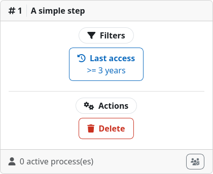

Each step has to contain one or more [filters](../filters/index.md) that decide which users will enter the step. For a
user to be considered applicable for entry, it has to satisfy all the filters of a step. For example, if a step contains
a [last access filter](../filters/lastaccess.md) and an [authentication method filter](../filters/auth.md), only users
that use the specified authentication method and have not accessed the site for a certain amount of time will enter the
step. The filters of the first step of a workflow decide which users will be ingested into the workflow, while the
filters of subsequent steps decide about transitions to the next step.

When a user enters a step, all [actions](../actions/index.md) defined for that step are executed at the moment of entry.
For example, if a step contains a [mail action](../actions/mail.md) and a [suspend action](../actions/suspend.md), the
user will receive an email and be suspended as soon as it enters the step. All actions are executed in the order they
are defined within the step from left to right.

## Inspecting

You can view all steps, filters, and actions of a workflow by going to the
[workflow details page](crud.md#create-sort-delete) under
{{ moodle_nav_path('...', 'User Lifecycle Management', 'Workflows') }}.

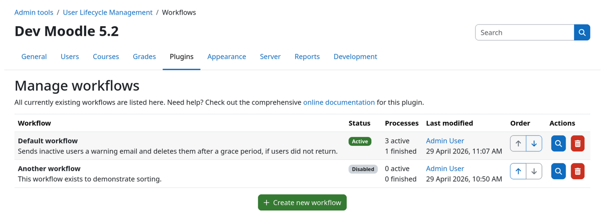{.img-thumbnail}
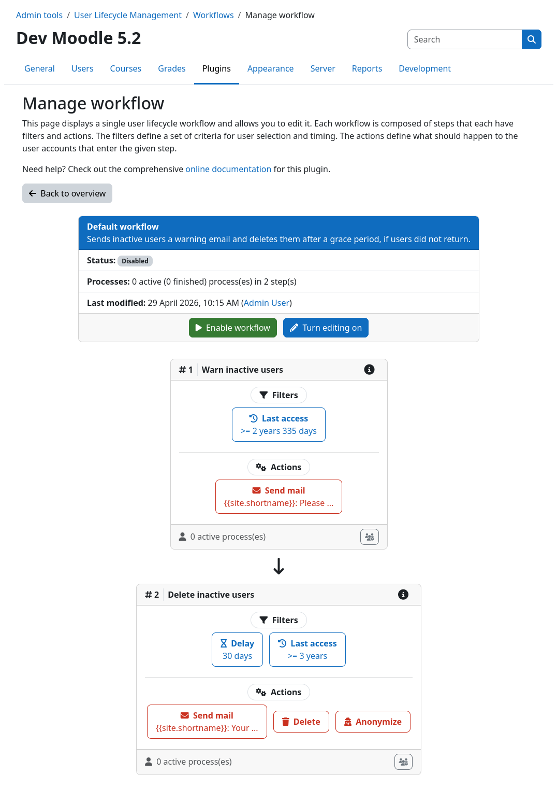{.img-thumbnail}

## Create, Sort, Delete

In order to do any modifications to a workflow, you need to enable edit mode first by clicking the edit button {{n2}}
within the workflow header {{n1}}.

You can **create a new step** by clicking the add step button {{n3}} at the bottom of the workflow. New steps are always
appended to the end of the workflow. You can **sort the steps** via the up and down buttons {{n4}} on the right of each
step. **Deleting a step** is done by clicking the trashcan button {{n5}} on the right of the desired step. Please note
that deleting a step will also delete all of its filters and actions.

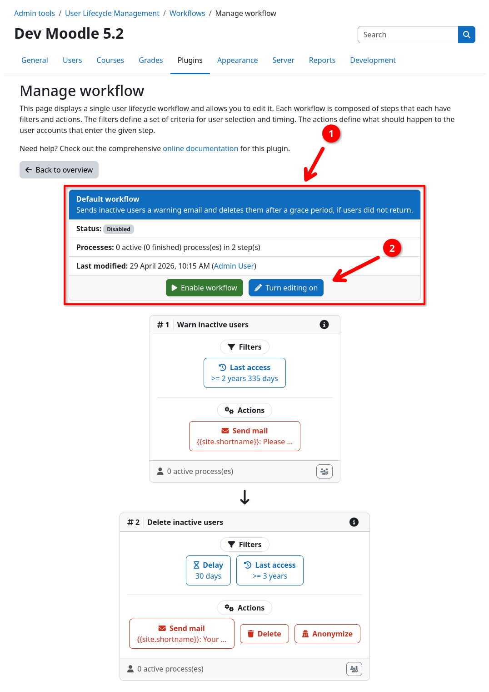{.img-thumbnail}
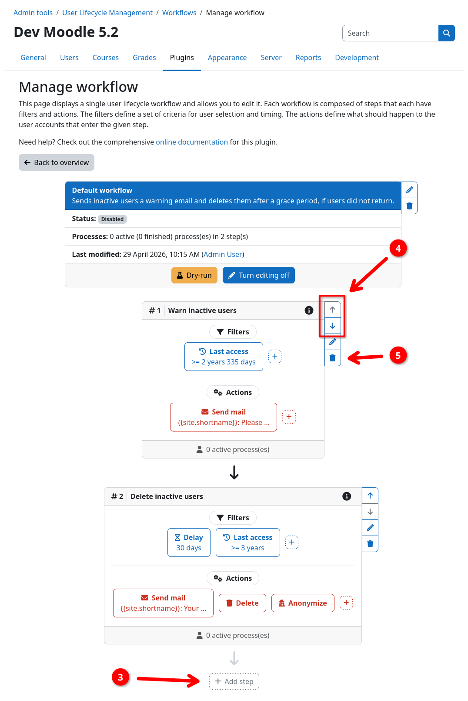{.img-thumbnail}

## Edit title and description

Each step can optionally be given a title and a description. It is strongly recommended to choose a descriptive title
for each step to make it easier to understand what a step does for future readers, including yourself in a few months.

To set a title or description, click the edit button {{n1}} on the right of the desired step. This opens a modal dialog
where you can edit the title and description of the step. The title is shown in directly in the step header. The
description however, will show as an info icon at the right of the step title. Hovering over the icon will display the
description in a tooltip.

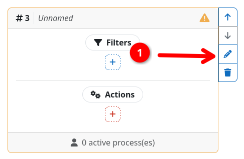{.img-thumbnail}
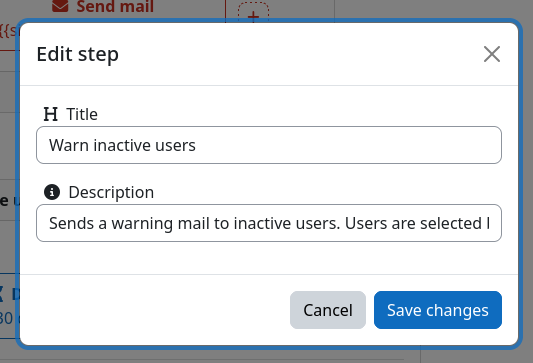{.img-thumbnail}
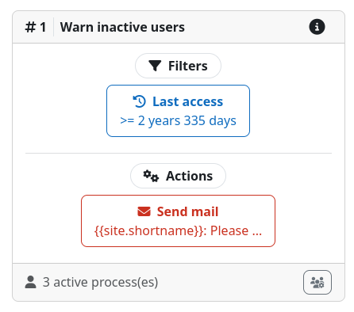{.img-thumbnail}

## Manage filters and actions

Once in edit mode, you can change the filters and actions of a step. To add a new filter or action, click on the 
respective plus icon {{n1}}. This opens a modal dialog where you can select the type of filter or action you want to
add.

To edit or delete an existing filter or action, click directly on the filter or action {{n2}} you want to edit. This
opens a modal dialog where you can change the settings of the selected instance or delete it via the button in the
bottom left corner.

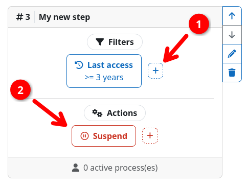{.img-thumbnail}
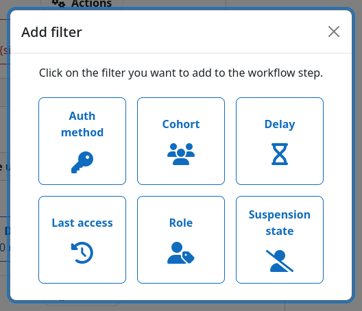{.img-thumbnail}
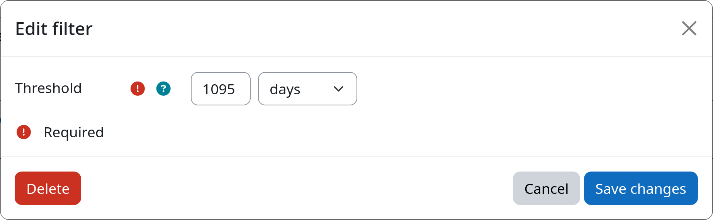{.img-thumbnail}

## Validity

In order for a step to be considered valid, it must contain at least one filter and one action. Also, all filters and
actions must be valid themselves (e.g., a last access filter must have a valid time period defined).

If a step is considered invalid, its border will turn yellow and you will see a yellow warning icon in the step's
header. If a filter or action is invalid, you will find the same yellow warning icon directly inside the box of the
invalid filter or action. Once you have fixed the issues, the warning icons and yellow border will disappear.

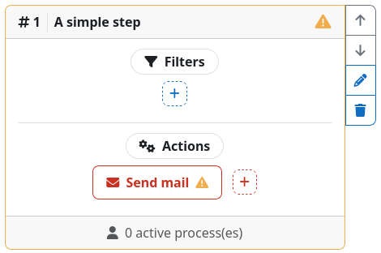{.img-thumbnail}
